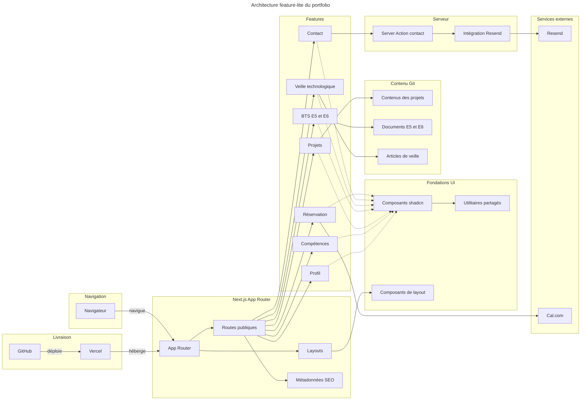

# INSTALL.md - Portfolio Student

Technical vision and installation guide.

## Vision

Portfolio professionnel de Yanis Harrat, étudiant en BTS SIO option SISR.

Le site présente son profil, ses compétences, ses projets personnels et étudiants, ses épreuves E5 et E6, ainsi que sa veille technologique. Il s'adresse principalement aux recruteurs, aux entreprises, aux enseignants et aux jurys du BTS, tout en centralisant la prise de rendez-vous, le contact et le téléchargement du CV.

## Decisions

| Decision | Choice | Why |
| --- | --- | --- |
| Architecture | Monolithe serverless feature-lite, statique en priorité | Un seul développeur, moins de 1 000 visiteurs mensuels, aucun temps réel et aucun multi-tenant ne justifient une architecture distribuée. |
| Front-end | Next.js 16 App Router, React 19 et TypeScript | Le SEO est important, la stack est déjà maîtrisée et les pages peuvent être pré-rendues par défaut. |
| Back-end | Server Action Next.js en TypeScript pour le formulaire de contact | Le seul traitement serveur prévu est l'envoi par Resend ; une Server Action évite d'exposer une API publique inutile. |
| Database | Aucune ; contenu MDX ou TypeScript versionné dans Git | Les projets, documents BTS et articles sont éditoriaux, peu volumineux et ne nécessitent ni requêtes transactionnelles ni administration dynamique. |
| Auth | Aucune | Toutes les routes sont publiques et aucun espace privé n'est prévu. |
| Hosting | GitHub + Vercel Hobby | Le dépôt est déjà connecté à Vercel, le trafic tient dans l'offre gratuite et le projet reste personnel et non commercial. |

### Naming conventions

- Le code, les fichiers et les identifiants techniques sont en anglais ; les contenus et les URL publiques sont en français.
- Les dossiers et fichiers utilisent `kebab-case`, les composants et types `PascalCase`, et les fonctions et variables `camelCase`.
- Les booléens commencent par `is`, `has`, `can` ou `should`; les hooks par `use`.
- Les suffixes décrivent le rôle lorsqu'ils apportent une information utile : `.action.ts`, `.schema.ts`, `.service.ts`, `.config.ts`, `.types.ts`, `.data.ts`, `.client.tsx`, `.server.ts` et `.test.tsx`.
- Les fichiers réservés de Next.js gardent leur nom exact : `page.tsx`, `layout.tsx`, `loading.tsx`, `error.tsx`, `not-found.tsx`, `sitemap.ts`, `robots.ts` et `opengraph-image.tsx`.
- Une feature commence à plat. Des sous-dossiers sont ajoutés uniquement lorsque sa taille rend cette séparation plus lisible.
- Aucun préfixe de type `IProject` ou `TProject`; les noms décrivent le domaine directement.

## Stack summary

- **Runtime cible :** Node.js 24.x sur Vercel ; pnpm 12.4.2.
- **Front-end :** Next.js 16.3.5, React 19.2.8, TypeScript 5.9.3.
- **Style et UI :** Tailwind CSS 4.3.3, shadcn 4.21.0, Base UI 1.8.0 et Lucide React.
- **Back-end :** Server Action Next.js et module serveur Resend, sans API publique initiale.
- **Contenu :** MDX ou modules TypeScript locaux, versionnés dans Git.
- **Database :** aucune.
- **Auth :** aucune.
- **Hosting :** Vercel Hobby, connecté au dépôt GitHub `yanix2445/Portfolio-Student`.
- **Key integrations :** Resend pour les e-mails, Cal.com pour les rendez-vous, GitHub pour le versionnement et Vercel pour le déploiement.
- **Référence de conception :** article « Architecture par feature avec Next.js 16 : guide complet », adapté ici en variante feature-lite.

## Architecture



`src/app` reste limité aux routes, aux layouts et aux métadonnées. Les capacités du portfolio vivent dans `src/features`, les contenus éditoriaux dans `src/content`, les primitives communes dans `src/components` et `src/lib`, et les secrets ou SDK serveur dans `src/server/integrations`.

Le formulaire de contact appelle Resend par une Server Action validée côté serveur. Cal.com reste un lien ou un composant d'intégration côté interface ; une route HTTP ne sera ajoutée que si un futur webhook, flux RSS ou client externe l'exige.

## Folder structure

```text
portfolio/
├── public/
│   ├── cv/
│   │   └── yanis-harrat-cv.pdf
│   ├── documents/
│   │   ├── e5/
│   │   └── e6/
│   └── images/
│       ├── open-graph/
│       ├── projects/
│       └── tech-watch/
│
├── src/
│   ├── app/
│   │   ├── projets/
│   │   │   ├── [slug]/
│   │   │   │   └── page.tsx
│   │   │   └── page.tsx
│   │   ├── bts/
│   │   │   ├── e5/
│   │   │   │   └── page.tsx
│   │   │   └── e6/
│   │   │       └── page.tsx
│   │   ├── veille/
│   │   │   ├── [slug]/
│   │   │   │   └── page.tsx
│   │   │   └── page.tsx
│   │   ├── contact/
│   │   │   └── page.tsx
│   │   ├── globals.css
│   │   ├── layout.tsx
│   │   ├── not-found.tsx
│   │   ├── opengraph-image.tsx
│   │   ├── page.tsx
│   │   ├── robots.ts
│   │   └── sitemap.ts
│   │
│   ├── features/
│   │   ├── profile/
│   │   │   ├── profile-section.tsx
│   │   │   └── profile.types.ts
│   │   ├── skills/
│   │   │   ├── skills-grid.tsx
│   │   │   └── skills.data.ts
│   │   ├── projects/
│   │   │   ├── project-card.tsx
│   │   │   ├── project-list.tsx
│   │   │   ├── project.types.ts
│   │   │   └── project-card.test.tsx
│   │   ├── bts/
│   │   │   ├── competency-table.tsx
│   │   │   └── bts.types.ts
│   │   ├── tech-watch/
│   │   │   ├── watch-card.tsx
│   │   │   └── watch.types.ts
│   │   ├── contact/
│   │   │   ├── contact-form.client.tsx
│   │   │   ├── contact.schema.ts
│   │   │   ├── contact.types.ts
│   │   │   ├── send-contact.action.ts
│   │   │   └── send-contact.action.test.ts
│   │   └── booking/
│   │       └── cal-booking-link.tsx
│   │
│   ├── content/
│   │   ├── projects/
│   │   │   └── project-slug.mdx
│   │   ├── bts/
│   │   │   ├── e5/
│   │   │   └── e6/
│   │   └── tech-watch/
│   │       └── article-slug.mdx
│   │
│   ├── components/
│   │   ├── layout/
│   │   │   ├── site-footer.tsx
│   │   │   ├── site-header.tsx
│   │   │   └── site-navigation.client.tsx
│   │   └── ui/
│   │       └── button.tsx
│   │
│   ├── lib/
│   │   ├── content/
│   │   │   ├── content-loader.server.ts
│   │   │   └── content.types.ts
│   │   ├── metadata.ts
│   │   ├── site.config.ts
│   │   └── utils.ts
│   │
│   ├── server/
│   │   └── integrations/
│   │       └── resend.service.ts
│   │
│   └── mdx-components.tsx
│
├── next.config.ts
├── package.json
└── tsconfig.json
```

## Install steps

- [ ] Utiliser Node.js 24.x et pnpm 12.4.2 pour rester aligné avec l'environnement de production Vercel.
- [ ] Cloner `git@github.com:yanix2445/Portfolio-Student.git`, puis installer les dépendances verrouillées avec `pnpm install`.
- [ ] Ajouter les dépendances MDX et Resend au moment d'implémenter le contenu éditorial et le formulaire, sans installer de base de données ni de fournisseur d'authentification.
- [ ] Créer `.env.local` avec `RESEND_API_KEY`, `CONTACT_TO_EMAIL`, `NEXT_PUBLIC_CALCOM_URL` et `NEXT_PUBLIC_SITE_URL`, puis reproduire ces variables dans Vercel sans les committer.
- [ ] Ajouter le CV, les justificatifs E5/E6 et les images optimisées dans `public`, puis les contenus projets et veille dans `src/content`.
- [ ] Vérifier chaque livraison avec `pnpm lint` et `pnpm build`, puis pousser sur GitHub pour déclencher le déploiement Vercel.

## Audit summary

Results of the multi-agent audit run during action 03:

| Candidate | Verdict | Notes |
| --- | --- | --- |
| Next.js minimal | ⚠️ | Compatible et adapté au besoin ; ne pas activer l'export statique strict, et réserver Vercel Hobby à l'usage personnel non commercial. |
| Next.js + Supabase | ⚠️ | Compatible, mais l'auth SSR, les politiques RLS et la suspension des projets gratuits ajoutent une complexité sans bénéfice actuel. |
| Astro + Cloudflare | ⚠️ | Compatible et économique, mais impose une migration et une nouvelle chaîne Astro, React et Workers alors que Next.js est déjà en place. |
