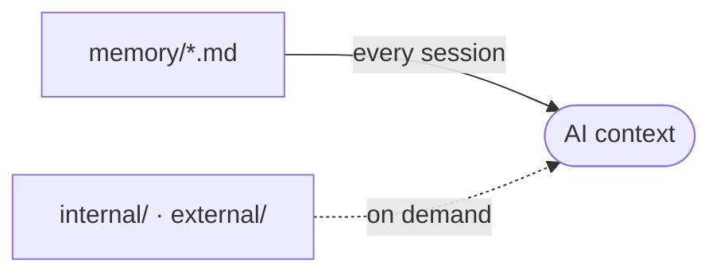

# memory/ - Project Memory

Structured context the AI assistant reads at the start of a session, so it does not rediscover the project each time.

## How it loads

## Files

Refreshed automatically by the memory hook. Do not edit by hand.

<!-- files:start -->
- [architecture.md](architecture.md)
- [codebase-map.md](codebase-map.md)
- [coding-assertions.md](coding-assertions.md)
- [design.md](design.md)
- [ecosystem.md](ecosystem.md)
- [forms.md](forms.md)
- [navigation.md](navigation.md)
- [project-brief.md](project-brief.md)
- [testing.md](testing.md)
- [vcs.md](vcs.md)
<!-- files:end -->

## Maintaining it

The AI writes and refreshes these files. When you edit one by hand:

- One file per concern (architecture, database, vcs, ...).
- Capture the macro and the non-derivable. Point to the code, never copy it.
- Current state only, kept small. No personal notes, no future TODOs.

## Subdirectories

- `internal/`: AIDD workflow traces (the capability profile, audit notes, learn captures).
- `external/`: external references the project pulls in (specs, design docs).
