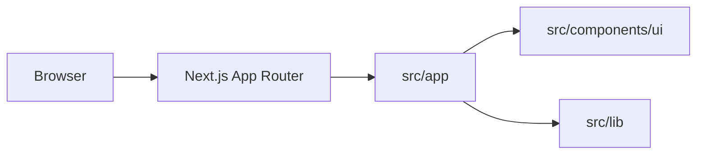

# Architecture

## Stack

- TypeScript, React et Next.js App Router pour une application web rendue côté serveur ou statiquement selon les pages.
- Tailwind CSS et shadcn avec Base UI pour composer l'interface à partir de primitives accessibles.
- pnpm est le gestionnaire de paquets du projet.

## How it fits together

## Key decisions

- Les routes et layouts vivent dans `src/app`; les composants réutilisables restent dans `src/components`.
- Les primitives shadcn sont adaptées localement plutôt que remplacées par une bibliothèque de pages prête à l'emploi.
- Les intégrations externes restent isolées de l'interface et sont documentées dans `ecosystem.md`.

## Gotchas

- La version de Next.js utilisée introduit des changements incompatibles; lire la documentation embarquée dans `node_modules/next/dist/docs/` avant de modifier une API ou une convention Next.js.
