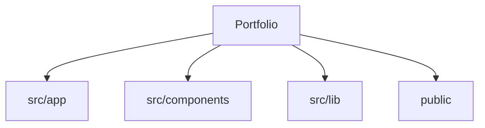

# Codebase Map

## Areas

- `src/app`: routes, layouts, métadonnées et styles globaux de l'App Router.
- `src/components`: composants React partagés, dont les primitives shadcn.
- `src/lib`: utilitaires partagés sans responsabilité d'interface.
- `public`: ressources statiques servies telles quelles.

## Entry points

- `src/app/layout.tsx`: layout racine et métadonnées globales.
- `src/app/page.tsx`: page d'accueil.
- `src/app/globals.css`: thème Tailwind et variables visuelles globales.
