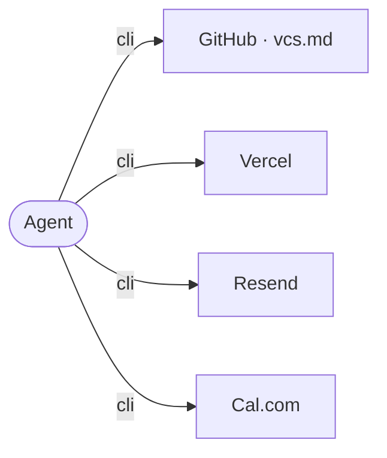

# Ecosystem

```mermaid
flowchart LR
    Agent([Agent])
    GitHub["GitHub · vcs.md"]
    Vercel["Vercel"]
    Resend["Resend"]
    Cal["Cal.com"]

    Agent -- cli --> GitHub
    Agent -- cli --> Vercel
    Agent -- cli --> Resend
    Agent -- cli --> Cal
```
