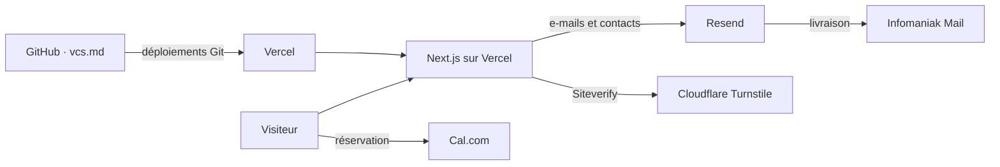

# Ecosystem

## Production ownership

- Vercel héberge l'application Next.js et ses Server Actions.
- Cloudflare fournit le DNS du domaine et Turnstile; il n'héberge pas l'application.
- Infomaniak reste le fournisseur de réception pour `yanis-harrat.com`.
- Resend envoie les messages transactionnels et maintient le segment/topic de veille.
