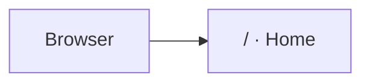

# Navigation

## Routing

- Next.js App Router définit les routes dans `src/app`.
- Seule la route publique `/` existe; aucune route protégée ni authentification applicative n'est configurée.

## Structure

