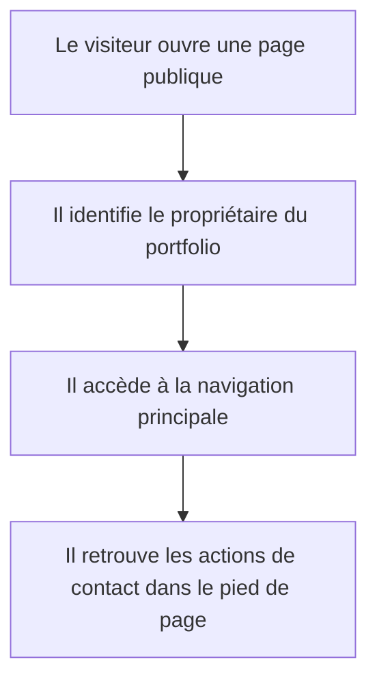
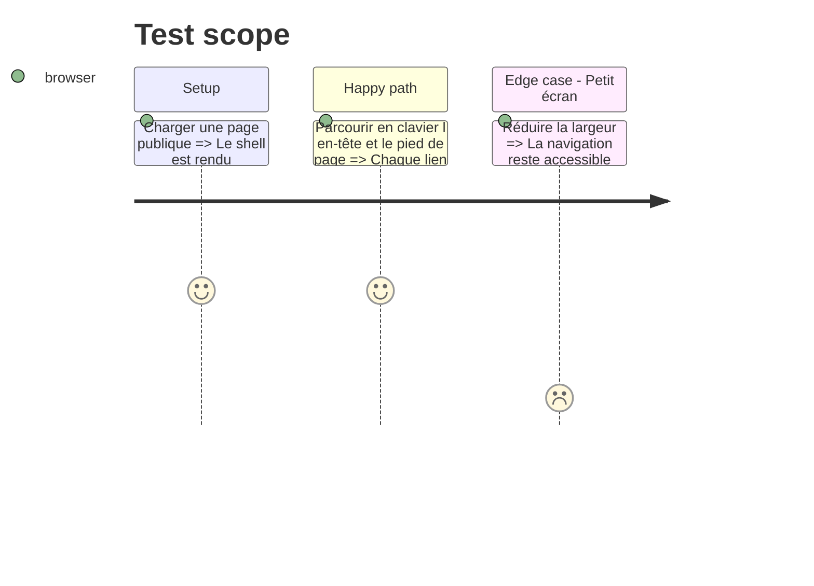

# Instruction: Fondations visuelles, conventions et shell public

## Architecture projection

> Tree of the final files. ✅ create · ✏️ modify · ❌ delete

```txt
.
├── components.json                                      ✏️ aliaser les primitives vers shared
├── src/app/globals.css                                  ✏️ formaliser les tokens et états globaux
├── src/app/layout.tsx                                   ✏️ composer le shell public et les métadonnées de base
├── src/components/ui/button.tsx                         ❌ migrer la primitive vers shared
├── src/lib/utils.ts                                     ❌ migrer l'utilitaire vers shared
├── src/shared/components/site-footer.tsx                ✅ fournir le pied de page commun
├── src/shared/components/site-header.test.tsx           ✅ vérifier la navigation accessible
├── src/shared/components/site-header.tsx                ✅ fournir l'en-tête commun
├── src/shared/config/site.config.ts                     ✅ centraliser identité et destinations publiques
├── src/shared/lib/cn.ts                                  ✅ centraliser l'assemblage de classes
└── src/shared/ui/button.tsx                              ✅ accueillir la primitive shadcn partagée
```

## User Journey



## Test Scope



## Wireframe

```txt
┌──────────────────────────────────────────────────────┐
│ (1) En-tête : identité · navigation · rendez-vous    │
├──────────────────────────────────────────────────────┤
│ (2) Contenu de la route                              │
├──────────────────────────────────────────────────────┤
│ (3) Pied : navigation secondaire · contact · statut  │
└──────────────────────────────────────────────────────┘
```

## Tasks to do

### `1)` Fixer les conventions d'architecture et de nommage

> Rendre la structure prévisible avant d'ajouter les domaines.

1. Utiliser `kebab-case` pour les fichiers et dossiers.
2. Réserver `*.data.ts`, `*.types.ts`, `*.schema.ts`, `*.action.ts`, `*.service.ts` et `*.test.ts(x)` à leurs responsabilités respectives.
3. Exposer chaque feature importante avec un `index.ts` explicite.

### `2)` Migrer les fondations génériques vers `src/shared`

> Aligner les primitives et utilitaires sur l'architecture par feature.

1. Déplacer la primitive bouton et `cn` sans changer leur contrat.
2. Mettre à jour les alias shadcn.
3. Supprimer les anciens emplacements après mise à jour des imports.

### `3)` Construire le shell et les tokens du site

> Garantir une navigation et une identité cohérentes sur toutes les routes.

1. Centraliser les coordonnées, liens et libellés publics dans `site.config.ts`.
2. Ajouter l'en-tête et le pied de page sémantiques.
3. Formaliser la palette sombre et orange, la typographie, les espacements, les focus et la réduction des animations.

## Test acceptance criteria

| Task | Acceptance criteria |
| ---- | ------------------- |
| 1 | Un fichier peut être classé sans ambiguïté par son nom et aucune page n'importe l'intérieur privé d'une autre feature. |
| 2 | Les composants existants utilisent les nouveaux chemins partagés et les anciens fichiers n'existent plus. |
| 3 | Toutes les pages affichent un en-tête et un pied de page cohérents, utilisables au clavier et sans débordement sur téléphone. |
