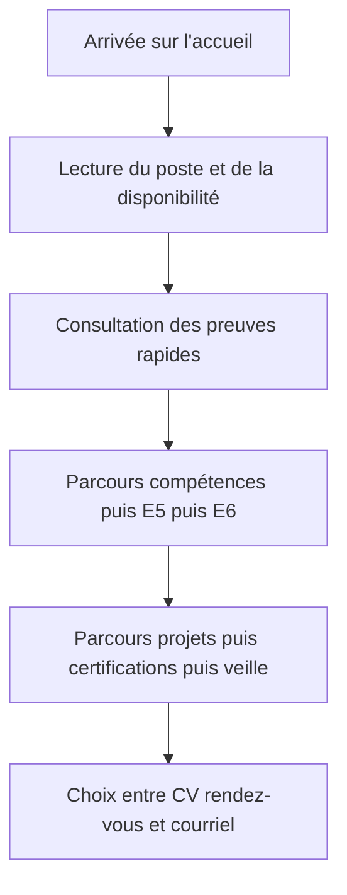
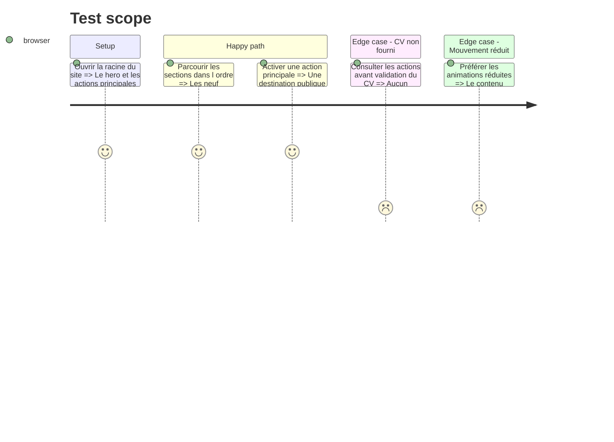

# Instruction: Accueil complet orienté décision recruteur

## Architecture projection

> Tree of the final files. ✅ create · ✏️ modify · ❌ delete

```txt
.
├── src/app/page.tsx                                            ✏️ composer la nouvelle feature d'accueil
├── src/features/home/components/home-certifications-preview.tsx ✅ résumer les certifications
├── src/features/home/components/home-contact-cta.tsx          ✅ conclure par les actions de conversion
├── src/features/home/components/home-e5-preview.tsx            ✅ résumer expériences et E5
├── src/features/home/components/home-e6-preview.tsx            ✅ afficher les deux statuts E6
├── src/features/home/components/home-hero.tsx                  ✅ présenter profil et disponibilité
├── src/features/home/components/home-page.test.tsx             ✅ vérifier ordre et actions essentielles
├── src/features/home/components/home-page.tsx                  ✅ orchestrer les sections de l'accueil
├── src/features/home/components/home-projects-preview.tsx      ✅ résumer les projets
├── src/features/home/components/home-proof-strip.tsx           ✅ afficher les preuves rapides
├── src/features/home/components/home-skills-preview.tsx        ✅ résumer les compétences remarquables
├── src/features/home/components/home-watch-preview.tsx         ✅ présenter veille et newsletter
├── src/features/home/home.data.ts                              ✅ centraliser les contenus validés de l'accueil
├── src/features/home/home.types.ts                             ✅ typer les sections de l'accueil
├── src/features/home/index.ts                                  ✅ exposer l'API publique de la feature
├── src/features/home/components/portfolio-landing.test.tsx     ❌ remplacer le test de l'ancienne landing
└── src/features/home/components/portfolio-landing.tsx          ❌ remplacer le composant monolithique
```

## User Journey



## Test Scope



## Wireframe

```txt
┌──────────────────────────────────────────────────────────┐
│ (1) Hero : profil · disponibilité · mobilité · actions   │
├──────────────────────────────────────────────────────────┤
│ (2) Preuves rapides                                     │
├──────────────────────────────────────────────────────────┤
│ (3) Compétences principales                             │
├──────────────────────────────────────────────────────────┤
│ (4) Expériences + E5                                    │
├──────────────────────────────────────────────────────────┤
│ (5) Deux réalisations E6                                │
├──────────────────────────────────────────────────────────┤
│ (6) Projets                                             │
├──────────────────────────────────────────────────────────┤
│ (7) Certifications                                     │
├──────────────────────────────────────────────────────────┤
│ (8) Veille + newsletter                                 │
├──────────────────────────────────────────────────────────┤
│ (9) CV · rendez-vous · courriel                         │
└──────────────────────────────────────────────────────────┘
```

## Tasks to do

### `1)` Recomposer le hero pour la décision recruteur

> Afficher toutes les informations décisives dans la première zone visible.

1. Conserver le portrait et son traitement sombre et orange.
2. Afficher poste, disponibilité, contrats, mobilité et modes de travail.
3. Présenter les actions vers réalisations, rendez-vous et contact, avec CV conditionné à sa disponibilité.

### `2)` Construire le flux complet de l'accueil

> Respecter l'ordre validé sans transformer l'accueil en dossier exhaustif.

1. Créer une section dédiée pour chaque catégorie prévue.
2. Rendre les preuves et statuts lisibles avant les descriptions longues.
3. Préparer les liens qui seront activés à mesure que les pages détaillées sont livrées.

### `3)` Remplacer la landing monolithique et ses tests

> Obtenir une feature d'accueil composée et maintenable.

1. Répartir les sections en composants serveur ciblés.
2. Centraliser le contenu validé dans les données typées.
3. Vérifier la hiérarchie des titres, l'ordre du DOM et les destinations publiques.

## Test acceptance criteria

| Task | Acceptance criteria |
| ---- | ------------------- |
| 1 | Sans défiler, un recruteur lit le poste, la disponibilité, les contrats, la zone géographique et les modes de travail acceptés. |
| 2 | Les sections apparaissent dans l'ordre validé et chaque aperçu annonce clairement la nature de sa preuve ou son statut. |
| 3 | L'accueil ne dépend plus du composant monolithique, conserve un seul titre principal et expose des actions nommées au clavier. |
