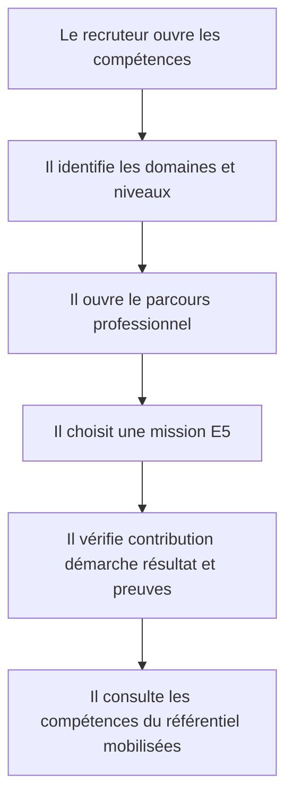
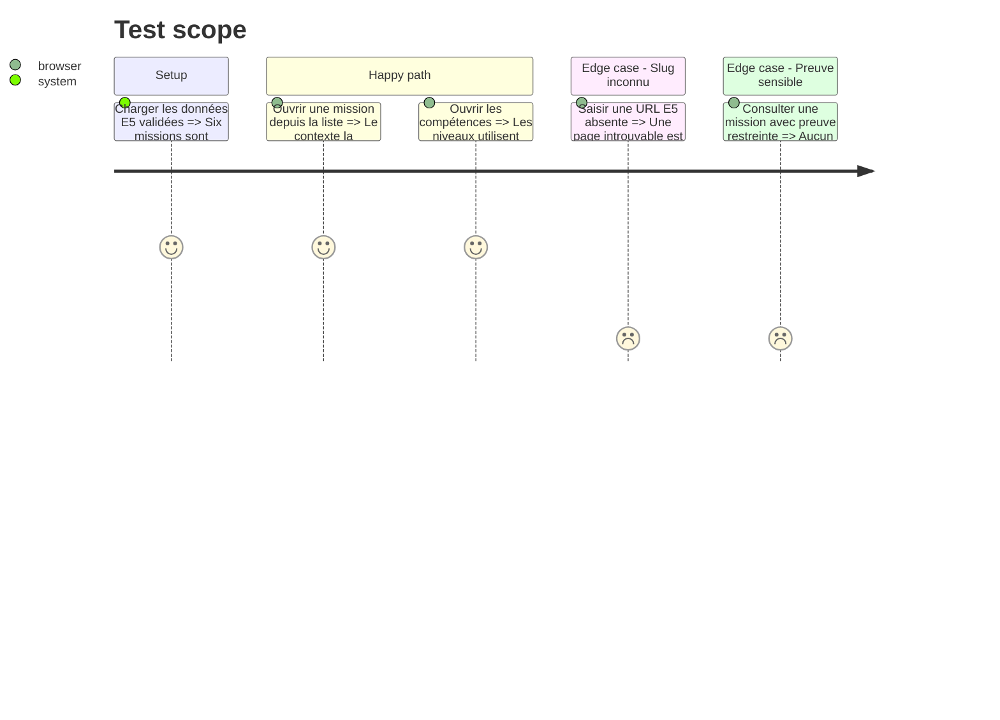

# Instruction: Compétences, expériences et six réalisations E5

## Architecture projection

> Tree of the final files. ✅ create · ✏️ modify · ❌ delete

```txt
.
├── src/app/competences/page.tsx                                  ✅ exposer le détail des compétences
├── src/app/parcours/page.tsx                                     ✅ exposer les deux expériences
├── src/app/epreuves/e5/page.tsx                                  ✅ lister les six réalisations
├── src/app/epreuves/e5/[slug]/page.tsx                           ✅ afficher une fiche E5
├── src/features/home/home.data.ts                                ✏️ relier les aperçus aux pages livrées
├── src/features/skills/components/skills-catalog.tsx             ✅ grouper domaines et niveaux
├── src/features/skills/index.ts                                  ✅ exposer la feature compétences
├── src/features/skills/skills.data.ts                            ✅ décrire les compétences validées
├── src/features/skills/skill.types.ts                            ✅ typer domaine et niveau crédible
├── src/features/experiences/components/experience-timeline.tsx   ✅ présenter les stages chronologiquement
├── src/features/experiences/experiences.data.ts                  ✅ centraliser périodes et contextes
├── src/features/experiences/experience.types.ts                  ✅ typer une expérience professionnelle
├── src/features/experiences/index.ts                             ✅ exposer la feature expériences
├── src/features/bts-e5/components/e5-detail.tsx                  ✅ structurer une fiche de réalisation
├── src/features/bts-e5/components/e5-list.tsx                    ✅ grouper les missions par entreprise
├── src/features/bts-e5/e5.data.test.ts                           ✅ garantir exactement six missions cohérentes
├── src/features/bts-e5/e5.data.ts                                ✅ centraliser les six missions validées
├── src/features/bts-e5/e5.types.ts                               ✅ typer contexte contribution preuves et référentiel
└── src/features/bts-e5/index.ts                                  ✅ exposer listes et accès par slug
```

## User Journey



## Test Scope



## Wireframe

```txt
┌──────────────────────────────────────────────────────────┐
│ (1) Introduction de rubrique                            │
├────────────────┬─────────────────────────────────────────┤
│ (2) Sommaire   │ (3) Cartes groupées par entreprise     │
│ ou domaines    │     statut · résumé · compétences       │
├────────────────┴─────────────────────────────────────────┤
│ (4) Accès vers la fiche détaillée                       │
└──────────────────────────────────────────────────────────┘

┌──────────────────────────────────────────────────────────┐
│ (1) Catégorie · titre · entreprise · période             │
├──────────────────────────────────┬───────────────────────┤
│ (2) Besoin · contribution        │ (3) Rôle · outils     │
│     démarche · difficultés       │     compétences       │
│     résultat disponible          │                       │
├──────────────────────────────────┴───────────────────────┤
│ (4) Preuves publiables et navigation voisine            │
└──────────────────────────────────────────────────────────┘
```

## Tasks to do

### `1)` Modéliser les compétences et expériences

> Présenter une expertise crédible sans score artificiel.

1. Grouper les technologies par domaines lisibles.
2. Limiter les niveaux à autonome, opérationnel et en cours d'approfondissement.
3. Présenter EDLearn puis Secours Catholique-Caritas France avec leurs périodes et le même poste.

### `2)` Structurer les six réalisations E5

> Transformer chaque mission réelle en preuve consultable.

1. Définir les six slugs stables et leurs champs obligatoires.
2. Relier chaque mission à son entreprise et aux compétences du référentiel.
3. Distinguer résultat prouvé, preuve publiable et information expurgée.

### `3)` Livrer les routes de liste et de détail

> Permettre un parcours du résumé vers les preuves.

1. Garder les `page.tsx` fins et composer les features.
2. Générer les pages de détail depuis les slugs connus.
3. Retourner une page introuvable pour toute réalisation absente.

## Test acceptance criteria

| Task | Acceptance criteria |
| ---- | ------------------- |
| 1 | Les compétences sont regroupées par domaine et chaque niveau appartient au vocabulaire validé. |
| 2 | La rubrique E5 contient exactement six missions, trois par entreprise, sans résultat non sourcé ni donnée sensible. |
| 3 | Chaque carte E5 ouvre une URL unique dont la fiche contient tous les champs exigés par la spécification. |
