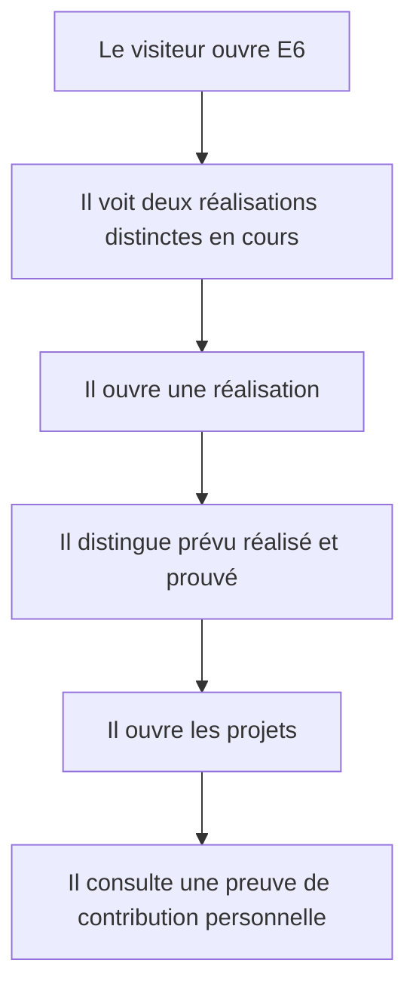
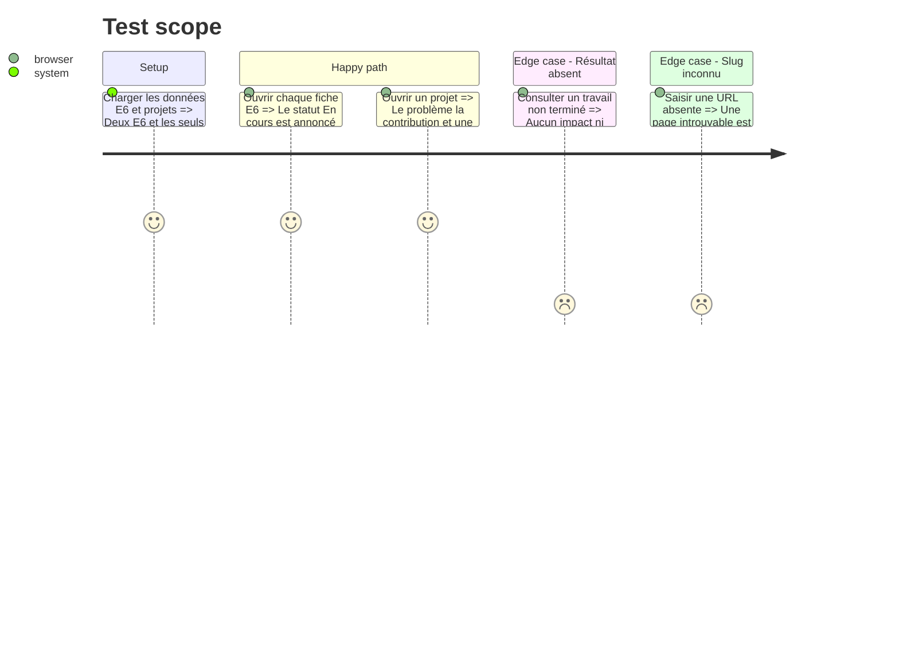

# Instruction: Deux réalisations E6 et projets démontrables

## Architecture projection

> Tree of the final files. ✅ create · ✏️ modify · ❌ delete

```txt
.
├── src/app/epreuves/e6/page.tsx                                 ✅ lister les deux réalisations E6
├── src/app/epreuves/e6/[slug]/page.tsx                          ✅ afficher une fiche E6
├── src/app/projets/page.tsx                                     ✅ lister les projets validés
├── src/app/projets/[slug]/page.tsx                              ✅ afficher une fiche projet
├── src/features/home/home.data.ts                               ✏️ relier les aperçus E6 et projets
├── src/features/bts-e6/components/e6-detail.tsx                 ✅ structurer une réalisation en cours
├── src/features/bts-e6/components/e6-list.tsx                   ✅ présenter exactement deux réalisations
├── src/features/bts-e6/e6.data.test.ts                          ✅ verrouiller nombre statuts et preuves
├── src/features/bts-e6/e6.data.ts                               ✅ centraliser uniquement les contenus validés
├── src/features/bts-e6/e6.types.ts                              ✅ typer statut périmètre et preuves
├── src/features/bts-e6/index.ts                                 ✅ exposer listes et accès par slug
├── src/features/projects/components/project-detail.tsx          ✅ présenter problème contribution et résultat
├── src/features/projects/components/project-list.tsx            ✅ lister les projets démontrables
├── src/features/projects/index.ts                               ✅ exposer la feature projets
├── src/features/projects/project.types.ts                       ✅ typer projet liens et preuves
└── src/features/projects/projects.data.ts                       ✅ centraliser les projets réellement documentés
```

## User Journey



## Test Scope



## Wireframe

```txt
┌──────────────────────────────────────────────────────────┐
│ (1) Rubrique · finalité · statut global                  │
├──────────────────────────────────────────────────────────┤
│ (2) Carte : titre · statut · périmètre · preuve          │
├──────────────────────────────────────────────────────────┤
│ (3) Carte : titre · statut · périmètre · preuve          │
└──────────────────────────────────────────────────────────┘

┌──────────────────────────────────────────────────────────┐
│ (1) Titre · catégorie · statut                           │
├──────────────────────────────────┬───────────────────────┤
│ (2) Problème · contribution      │ (3) Outils · période  │
│     démarche · état actuel       │     compétences       │
├──────────────────────────────────┴───────────────────────┤
│ (4) Preuves disponibles · limites · liens                │
└──────────────────────────────────────────────────────────┘
```

## Tasks to do

### `1)` Modéliser les réalisations E6 sans anticiper les résultats

> Montrer le travail en cours avec une frontière nette entre intention et preuve.

1. Créer exactement deux entrées au statut `in-progress`.
2. Publier le premier périmètre seulement à partir du contenu déjà validé.
3. Garder le second périmètre minimal tant que son titre et ses preuves ne sont pas confirmés.

### `2)` Structurer les projets personnels et étudiants

> Montrer une contribution individuelle et un résultat vérifiable.

1. N'inclure que les projets possédant un contexte réel.
2. Ajouter les liens GitHub, démonstrations ou documents uniquement lorsqu'ils existent.
3. Différencier clairement projet personnel, étudiant et réalisation BTS.

### `3)` Livrer les listes et fiches détaillées

> Créer des parcours cohérents sans dupliquer la logique dans les routes.

1. Composer les pages depuis les API publiques des features.
2. Générer les détails depuis les slugs validés.
3. Relier l'accueil aux nouvelles rubriques.

## Test acceptance criteria

| Task | Acceptance criteria |
| ---- | ------------------- |
| 1 | Deux réalisations E6 distinctes sont visibles et toutes deux portent explicitement le statut « En cours ». |
| 2 | Chaque projet publié identifie un problème, la contribution de Yanis et au moins une preuve réellement disponible. |
| 3 | Les routes inconnues retournent une page introuvable et les aperçus de l'accueil ouvrent les pages attendues. |
