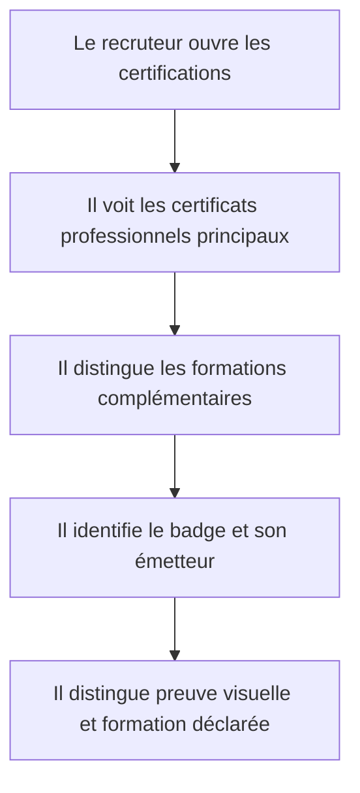
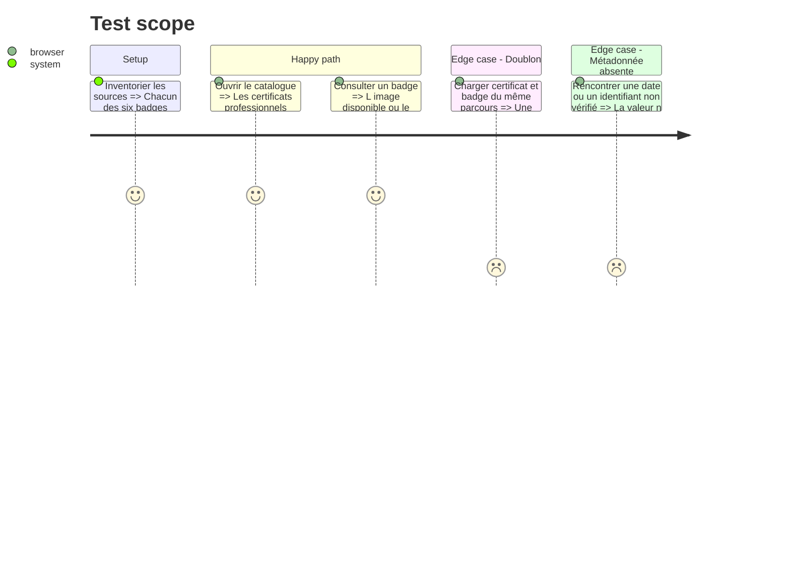

# Instruction: Catalogue de certifications et preuves publiables

## Architecture projection

> Tree of the final files. ✅ create · ✏️ modify · ❌ delete

```txt
.
├── public/images/certifications/cisco-cybersecurity-badge.png           ✅ publier le badge utile
├── public/images/certifications/google-cybersecurity-badge.png          ✅ publier le badge utile
├── public/images/certifications/google-it-support-badge.png             ✅ publier le badge utile
├── src/app/certifications/page.tsx                                      ✅ exposer le catalogue
├── src/features/home/home.data.ts                                       ✏️ relier l'aperçu aux certifications
├── src/features/certifications/certification.types.ts                   ✅ typer nature émetteur date et preuve
├── src/features/certifications/certifications.data.test.ts              ✅ vérifier catégories unicité et fichiers
├── src/features/certifications/certifications.data.ts                   ✅ inventorier les preuves retenues
├── src/features/certifications/components/certification-catalog.tsx     ✅ séparer certificats professionnels et cours
├── src/features/certifications/components/certification-card.tsx        ✅ présenter une preuve sans doublon
└── src/features/certifications/index.ts                                 ✅ exposer la feature certifications
```

## User Journey



## Test Scope



## Wireframe

```txt
┌──────────────────────────────────────────────────────────┐
│ (1) Introduction · nombre · organismes                   │
├──────────────────────────────────────────────────────────┤
│ (2) Certificats professionnels principaux               │
│     carte · carte                                        │
├──────────────────────────────────────────────────────────┤
│ (3) Certifications et formations complémentaires       │
│     carte · carte · carte · carte                        │
├──────────────────────────────────────────────────────────┤
│ (4) Note sur la nature des badges affichés               │
└──────────────────────────────────────────────────────────┘
```

## Tasks to do

### `1)` Auditer et normaliser les badges locaux

> Publier uniquement les trois images de badge utiles avec des noms sûrs et lisibles.

1. Vérifier visuellement les badges Google Cybersecurity, Google IT Support et Cisco.
2. Copier uniquement ces trois images dans `public` avec des noms normalisés.
3. Ne publier aucun fichier PDF de certificat.

### `2)` Modéliser la distinction entre certification et formation

> Éviter de présenter tous les documents avec le même poids.

1. Séparer certificat professionnel, certificat de cours et badge.
2. Ne renseigner que les dates et identifiants effectivement visibles.
3. Utiliser un badge d'interface textuel pour chaque formation Anthropic, sans exposer son certificat PDF.

### `3)` Construire le catalogue accessible

> Donner une lecture rapide puis un accès vérifiable aux documents.

1. Mettre en avant Google Cybersecurity, Google IT Support et Cisco Introduction to Cybersecurity.
2. Regrouper les formations Anthropic dans une section complémentaire.
3. Relier l'aperçu de l'accueil au catalogue complet sans lien public vers les PDF.

## Test acceptance criteria

| Task | Acceptance criteria |
| ---- | ------------------- |
| 1 | Les trois images publiques possèdent un nom explicite, s'affichent correctement et aucun certificat PDF n'est publié. |
| 2 | Le catalogue distingue les certificats professionnels des cours et ne duplique pas un parcours pour chacun de ses sous-certificats. |
| 3 | Les six badges sont visibles, les trois certifications principales précèdent les formations Anthropic et chaque carte est compréhensible au clavier. |
