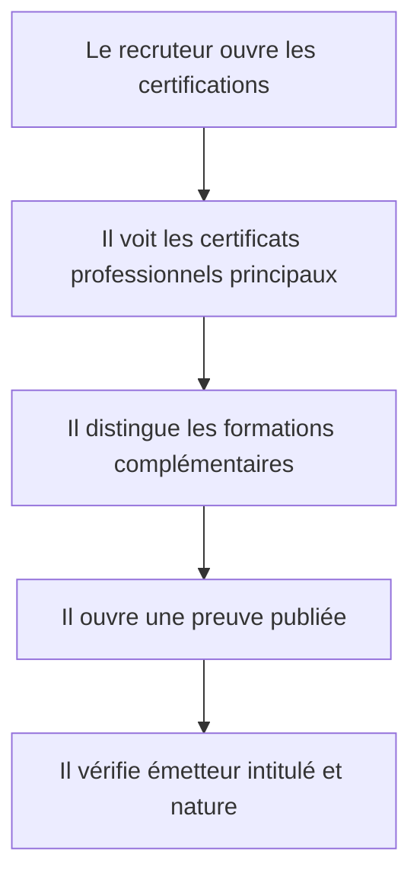

# Instruction: Catalogue de certifications et preuves publiables

## Architecture projection

> Tree of the final files. ✅ create · ✏️ modify · ❌ delete

```txt
.
├── public/documents/certifications/anthropic-ai-fluency.pdf             ✅ publier une copie au nom normalisé
├── public/documents/certifications/anthropic-claude-101.pdf             ✅ publier une copie au nom normalisé
├── public/documents/certifications/anthropic-claude-code-in-action.pdf  ✅ publier une copie au nom normalisé
├── public/documents/certifications/cisco-introduction-cybersecurity.pdf ✅ publier une copie au nom normalisé
├── public/documents/certifications/google-cybersecurity.pdf             ✅ publier le certificat professionnel principal
├── public/documents/certifications/google-it-support.pdf                ✅ publier le certificat professionnel principal
├── public/images/certifications/cisco-cybersecurity-badge.png           ✅ publier le badge utile
├── public/images/certifications/google-cybersecurity-badge.png          ✅ publier le badge utile
├── public/images/certifications/google-it-support-badge.png             ✅ publier le badge utile
├── src/app/certifications/page.tsx                                      ✅ exposer le catalogue
├── src/features/home/home.data.ts                                       ✏️ relier l'aperçu aux certifications
├── src/features/certifications/certification.types.ts                   ✅ typer nature émetteur date et preuve
├── src/features/certifications/certifications.data.test.ts              ✅ vérifier catégories unicité et fichiers
├── src/features/certifications/certifications.data.ts                   ✅ inventorier les preuves retenues
├── src/features/certifications/components/certification-catalog.tsx     ✅ séparer certificats professionnels et cours
├── src/features/certifications/components/certification-card.tsx        ✅ présenter une preuve sans doublon
└── src/features/certifications/index.ts                                 ✅ exposer la feature certifications
```

## User Journey



## Test Scope


## Wireframe

```txt
┌──────────────────────────────────────────────────────────┐
│ (1) Introduction · nombre · organismes                   │
├──────────────────────────────────────────────────────────┤
│ (2) Certificats professionnels principaux               │
│     carte · carte                                        │
├──────────────────────────────────────────────────────────┤
│ (3) Certifications et formations complémentaires       │
│     carte · carte · carte · carte                        │
├──────────────────────────────────────────────────────────┤
│ (4) Note de vérification et accès aux preuves            │
└──────────────────────────────────────────────────────────┘
```

## Tasks to do

### `1)` Auditer et normaliser les preuves locales

> Publier uniquement les documents nécessaires avec des noms sûrs et lisibles.

1. Vérifier visuellement l'intitulé et l'émetteur de chaque preuve retenue.
2. Copier les certificats principaux et badges utiles dans `public` avec des noms normalisés.
3. Exclure les doublons de cours déjà couverts par un certificat professionnel principal.

### `2)` Modéliser la distinction entre certification et formation

> Éviter de présenter tous les documents avec le même poids.

1. Séparer certificat professionnel, certificat de cours et badge.
2. Ne renseigner que les dates et identifiants effectivement visibles.
3. Lier chaque entrée à une seule preuve publique principale.

### `3)` Construire le catalogue accessible

> Donner une lecture rapide puis un accès vérifiable aux documents.

1. Mettre en avant Google Cybersecurity, Google IT Support et Cisco Introduction to Cybersecurity.
2. Regrouper les formations Anthropic dans une section complémentaire.
3. Relier l'aperçu de l'accueil au catalogue complet.

## Test acceptance criteria

| Task | Acceptance criteria |
| ---- | ------------------- |
| 1 | Chaque fichier public possède un nom explicite, s'ouvre correctement et ne révèle aucune donnée à expurger. |
| 2 | Le catalogue distingue les certificats professionnels des cours et ne duplique pas un parcours pour chacun de ses sous-certificats. |
| 3 | Les trois certifications principales sont visibles avant les formations complémentaires et chaque preuve est utilisable au clavier. |
