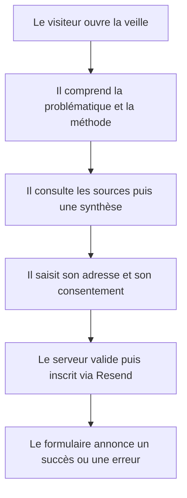
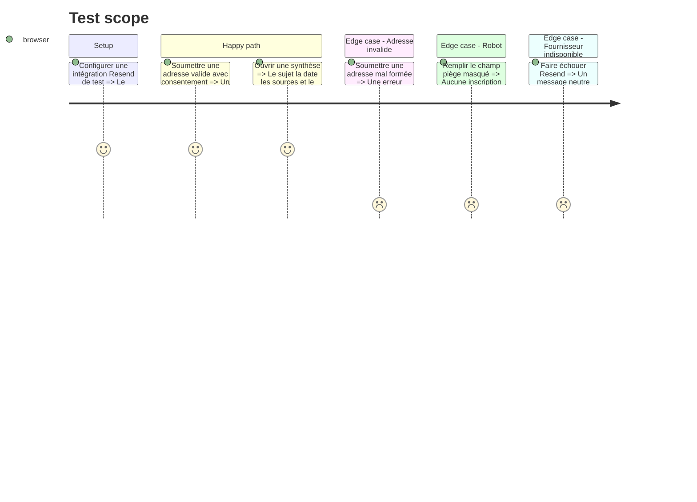

# Instruction: Veille technologique et inscription newsletter

## Architecture projection

> Tree of the final files. ✅ create · ✏️ modify · ❌ delete

```txt
.
├── .env.example                                                     ✅ documenter les variables Resend sans secret
├── package.json                                                     ✏️ ajouter validation et client Resend
├── pnpm-lock.yaml                                                   ✏️ verrouiller les dépendances ajoutées
├── src/app/veille/page.tsx                                          ✅ présenter sujet méthode sources et synthèses
├── src/app/veille/[slug]/page.tsx                                   ✅ afficher une synthèse de veille
├── src/features/home/home.data.ts                                   ✏️ relier l'aperçu à la veille
├── src/features/newsletter/actions/subscribe-newsletter.action.ts   ✅ valider et inscrire côté serveur
├── src/features/newsletter/components/newsletter-form.test.tsx      ✅ vérifier erreurs succès et attente
├── src/features/newsletter/components/newsletter-form.tsx           ✅ fournir la frontière cliente minimale
├── src/features/newsletter/index.ts                                 ✅ exposer le formulaire public
├── src/features/newsletter/newsletter.schema.ts                     ✅ valider adresse consentement et piège anti-robot
├── src/features/newsletter/newsletter.types.ts                      ✅ typer les états du formulaire
├── src/features/tech-watch/components/watch-article.tsx             ✅ rendre une synthèse datée et sourcée
├── src/features/tech-watch/components/watch-hub.tsx                 ✅ présenter problématique méthode et sources
├── src/features/tech-watch/index.ts                                 ✅ exposer la feature de veille
├── src/features/tech-watch/tech-watch.data.test.ts                  ✅ vérifier dates sources et slugs
├── src/features/tech-watch/tech-watch.data.ts                       ✅ centraliser sources et synthèses validées
├── src/features/tech-watch/tech-watch.types.ts                      ✅ typer source thème synthèse et date
└── src/server/integrations/resend.client.ts                         ✅ isoler le secret et le client serveur
```

## User Journey



## Test Scope



## Wireframe

```txt
┌──────────────────────────────────────────────────────────┐
│ (1) Sujet · problématique · méthode                      │
├──────────────────────────────────┬───────────────────────┤
│ (2) Synthèses datées             │ (3) Sources suivies   │
│     carte · carte                │     groupes · repères  │
├──────────────────────────────────┴───────────────────────┤
│ (4) Newsletter : adresse · consentement · état           │
└──────────────────────────────────────────────────────────┘

┌──────────────────────────────────────────────────────────┐
│ (1) Thème · titre · date                                 │
├──────────────────────────────────────────────────────────┤
│ (2) Synthèse structurée                                  │
├──────────────────────────────────────────────────────────┤
│ (3) Sources consultées                                   │
└──────────────────────────────────────────────────────────┘
```

## Tasks to do

### `1)` Structurer la veille et ses sources

> Démontrer une méthode régulière sur l'IA appliquée au développement web et applicatif.

1. Décrire problématique, critères de sélection, fréquence et restitution.
2. Organiser les sources par catégorie sans automatiser la collecte.
3. Publier uniquement des synthèses réelles, datées et reliées à leurs sources.

### `2)` Intégrer Resend côté serveur

> Inscrire une adresse sans exposer de secret ni introduire de base de données.

1. Ajouter le client serveur et documenter les variables attendues.
2. Valider adresse, consentement et champ anti-robot avant l'appel.
3. Créer ou mettre à jour le contact dans l'audience Resend configurée.

### `3)` Construire un formulaire progressif et accessible

> Rendre chaque état compréhensible au clavier et aux technologies d'assistance.

1. Utiliser une Server Action et `useActionState` pour les retours.
2. Associer les erreurs au champ et annoncer les résultats avec une zone live.
3. Désactiver la soumission pendant l'attente et traiter les échecs fournisseur sans fuite technique.

## Test acceptance criteria

| Task | Acceptance criteria |
| ---- | ------------------- |
| 1 | La page de veille expose sujet, méthode, sources et synthèses datées sans prétendre à une automatisation inexistante. |
| 2 | Une adresse valide est transmise à Resend côté serveur et aucune clé ni erreur fournisseur détaillée n'apparaît dans le navigateur. |
| 3 | Une adresse invalide, un robot présumé, un doublon et une panne fournisseur produisent chacun un retour explicite et accessible. |
