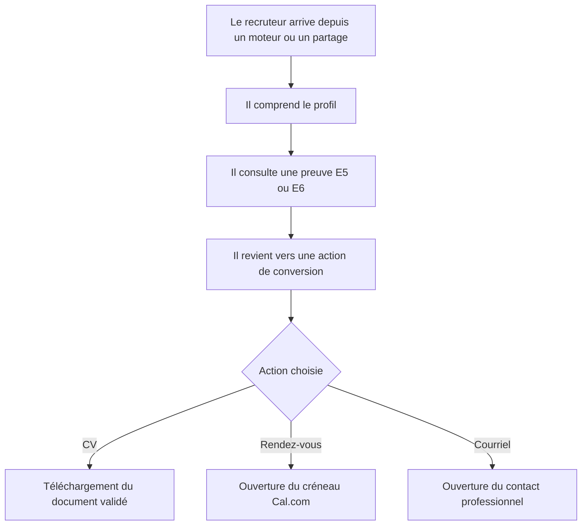
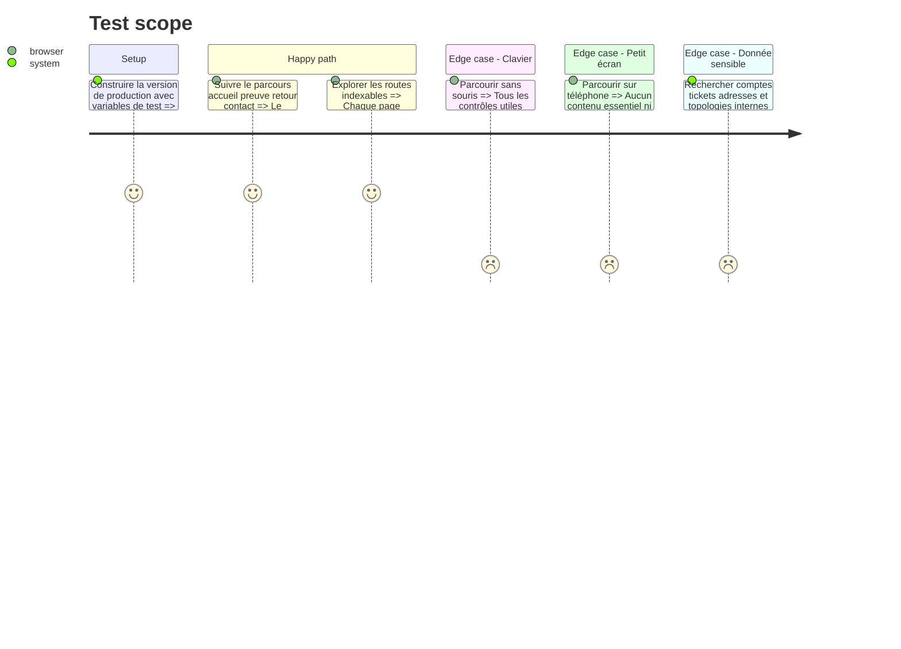

# Instruction: CV, contact, SEO, accessibilité et validation de production

## Architecture projection

> Tree of the final files. ✅ create · ✏️ modify · ❌ delete

```txt
.
├── package.json                                            ✏️ ajouter les contrôles navigateur nécessaires
├── pnpm-lock.yaml                                         ✏️ verrouiller les dépendances de validation
├── playwright.config.ts                                   ✅ configurer les parcours navigateur
├── public/documents/cv-yanis-harrat.pdf                   ✅ publier le CV fourni et validé
├── src/app/page.tsx                                       ✏️ finaliser les métadonnées de l'accueil
├── src/app/certifications/page.tsx                        ✏️ ajouter les métadonnées de la rubrique
├── src/app/competences/page.tsx                           ✏️ ajouter les métadonnées de la rubrique
├── src/app/parcours/page.tsx                              ✏️ ajouter les métadonnées de la rubrique
├── src/app/epreuves/e5/page.tsx                           ✏️ ajouter les métadonnées de la rubrique
├── src/app/epreuves/e5/[slug]/page.tsx                    ✏️ générer les métadonnées de chaque fiche
├── src/app/epreuves/e6/page.tsx                           ✏️ ajouter les métadonnées de la rubrique
├── src/app/epreuves/e6/[slug]/page.tsx                    ✏️ générer les métadonnées de chaque fiche
├── src/app/not-found.tsx                                  ✅ offrir une sortie utile pour les routes inconnues
├── src/app/opengraph-image.tsx                            ✅ générer une image de partage cohérente
├── src/app/projets/page.tsx                               ✏️ ajouter les métadonnées de la rubrique
├── src/app/projets/[slug]/page.tsx                        ✏️ générer les métadonnées de chaque fiche
├── src/app/robots.ts                                      ✅ déclarer les règles d'indexation
├── src/app/sitemap.ts                                     ✅ exposer toutes les routes publiques connues
├── src/app/veille/page.tsx                                ✏️ ajouter les métadonnées de la rubrique
├── src/app/veille/[slug]/page.tsx                         ✏️ générer les métadonnées de chaque synthèse
├── src/app/layout.tsx                                     ✏️ finaliser metadataBase et partage global
├── src/features/home/home.data.ts                         ✏️ activer le téléchargement du CV validé
├── src/shared/config/site.config.ts                       ✏️ finaliser domaine CV Cal.com courriels et profils
├── src/shared/seo/profile-json-ld.tsx                     ✅ décrire le profil professionnel en données structurées
├── tests/e2e/recruiter-journey.spec.ts                    ✅ couvrir le parcours recruteur principal
├── tests/e2e/bts-evidence.spec.ts                         ✅ couvrir E5 E6 preuves et confidentialité
└── tests/e2e/newsletter-accessibility.spec.ts             ✅ couvrir formulaire clavier et annonces
```

## User Journey



## Test Scope



## Wireframe

```txt
┌──────────────────────────────────────────────────────────┐
│ (1) Résumé professionnel et disponibilité                │
├──────────────────────────────────────────────────────────┤
│ (2) Preuve consultée                                     │
├──────────────────────────────────────────────────────────┤
│ (3) Actions finales : CV · rendez-vous · courriel        │
├──────────────────────────────────────────────────────────┤
│ (4) Navigation de retour et informations publiques       │
└──────────────────────────────────────────────────────────┘
```

## Tasks to do

### `1)` Finaliser les destinations de conversion

> Rendre les trois actions principales fiables et traçables par le visiteur.

1. Recevoir puis vérifier visuellement le CV final avant copie dans `public`.
2. Activer le téléchargement avec un nom de fichier explicite.
3. Vérifier le lien Cal.com et les adresses professionnelles centralisées.

### `2)` Compléter le socle SEO et partage

> Donner à chaque page une identité indexable cohérente avec son contenu.

1. Définir les métadonnées propres aux listes et détails.
2. Générer sitemap, robots, image de partage et données structurées.
3. Ajouter une page introuvable utile et des liens canoniques basés sur le domaine final.

### `3)` Valider les parcours et la confidentialité en production

> Fermer la livraison avec des preuves automatisées et une revue humaine ciblée.

1. Ajouter les parcours Playwright pour recrutement, BTS et newsletter.
2. Vérifier clavier, lecteurs d'écran, contrastes, mouvement réduit et responsive.
3. Rechercher toute donnée sensible ou affirmation sans preuve dans les sorties publiques.
4. Exécuter lint, tests, build et parcours navigateur sur la configuration de production.

## Test acceptance criteria

| Task | Acceptance criteria |
| ---- | ------------------- |
| 1 | Le CV validé se télécharge, Cal.com ouvre le bon événement et le courriel utilise l'adresse professionnelle prévue. |
| 2 | Chaque route publique possède des métadonnées cohérentes, figure dans le sitemap lorsqu'elle est indexable et produit un partage lisible. |
| 3 | Les parcours critiques passent sur téléphone et ordinateur, au clavier, sans donnée sensible ni affirmation non démontrée. |
