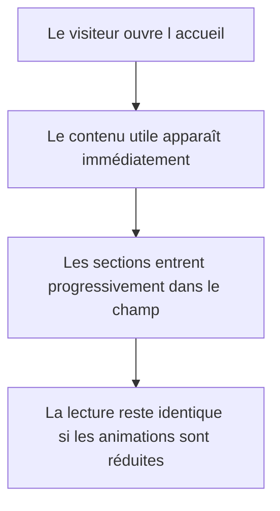
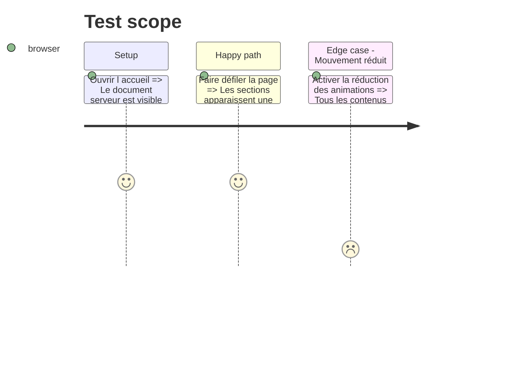

# Instruction: Fondations visuelles et mouvement progressif

## Architecture projection

> Tree of the final files. ✅ create · ✏️ modify · ❌ delete

```txt
.
├── src/app/globals.css                                           ✏️ ajouter les styles et états visuels limités à l'accueil
└── src/features/home/components
    ├── home-scroll-reveal.tsx                                    ✅ isoler la révélation progressive avec réduction du mouvement
    ├── home-section-heading.tsx                                  ✅ unifier les titres et introductions de section
    └── home-tagline-reveal.tsx                                   ✅ créer le manifeste animé mot par mot
```

## User Journey



## Test Scope



## Wireframe

```txt
┌──────────────────────────────────────────┐
│ (1) Titre de section et introduction     │
├──────────────────────────────────────────┤
│ (2) Contenu révélé dans le flux          │
├──────────────────────────────────────────┤
│ (3) Manifeste autonome en grand texte    │
└──────────────────────────────────────────┘
```

1. Titre : hiérarchie commune aux sections de l'accueil.
2. Contenu : enveloppe progressive sans modifier la sémantique.
3. Manifeste : bénéfice employeur lisible même sans animation.

## Tasks to do

### `1)` Définir le langage visuel de l'accueil

> Donner une base moderne, sombre et chaleureuse sans modifier les pages internes.

1. Ajouter une palette locale noire, graphite, ivoire et orange adouci.
2. Utiliser Geist, les tailles Tailwind et des rayons cohérents sur l'accueil.
3. Ajouter les états de focus, survol et activation avec des transitions physiques courtes.

### `2)` Construire les primitives de présentation

> Éviter la répétition de classes et limiter strictement le JavaScript client.

1. Créer un titre de section réutilisable.
2. Créer une révélation par `IntersectionObserver` avec solution de repli immédiate.
3. Créer le manifeste mot par mot avec prise en charge de `prefers-reduced-motion`.

## Test acceptance criteria

| Task | Acceptance criteria |
| ---- | ------------------- |
| 1 | Les styles de l'accueil utilisent une palette et des rayons cohérents sans altérer visuellement les routes internes. |
| 2 | Les contenus restent lisibles sans JavaScript, n'apparaissent qu'une fois avec JavaScript et ne sont pas animés lorsque le mouvement est réduit. |
