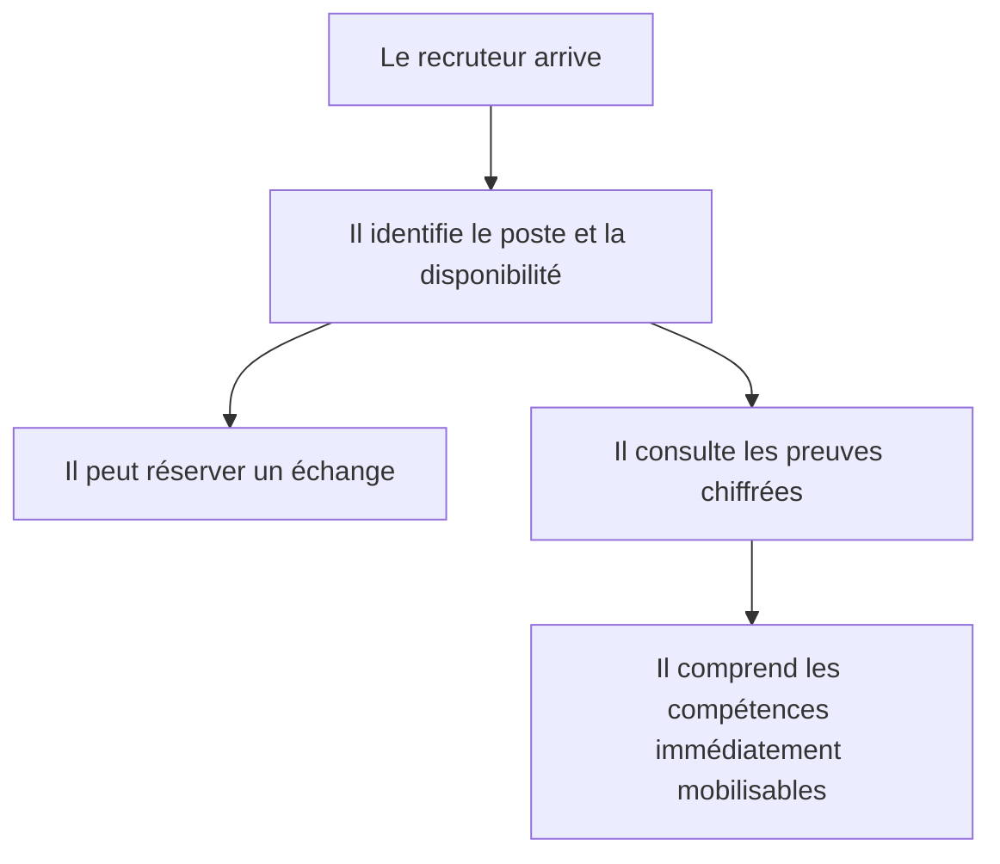
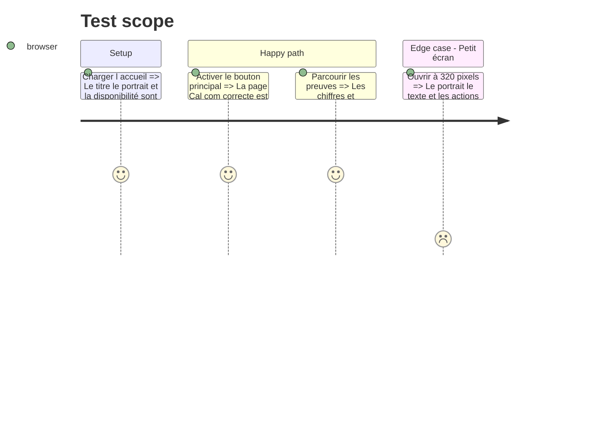

# Instruction: Présentation, preuves et compétences

## Architecture projection

> Tree of the final files. ✅ create · ✏️ modify · ❌ delete

```txt
.
└── src/features/home/components
    ├── home-hero.tsx                                             ✏️ reconstruire la première vue autour du rendez-vous et du portrait
    ├── home-page.tsx                                             ✏️ intégrer le nouveau rythme de lecture
    ├── home-proof-strip.tsx                                      ✏️ transformer les chiffres en preuves compactes
    └── home-skills-preview.tsx                                   ✏️ hiérarchiser les compétences et outils sans grille uniforme
```

## User Journey



## Test Scope



## Wireframe

```txt
┌─────────────────────────┬────────────────┐
│ (1) Profil et actions   │ (2) Portrait   │
├─────────────────────────┴────────────────┤
│ (3) Quatre preuves rapides               │
├──────────────────────────────────────────┤
│ (4) Manifeste employeur                  │
├───────────────────┬──────────────────────┤
│ (5) Compétences  │ (6) Outils et niveaux│
└───────────────────┴──────────────────────┘
```

1. Profil : poste, identité, disponibilité et action principale.
2. Portrait : photo personnelle et repères de mobilité.
3. Preuves : quatre données clés immédiatement vérifiables.
4. Manifeste : bénéfice professionnel en deux lignes.
5. Compétences : forces prioritaires pour le poste visé.
6. Outils : technologies et niveaux présentés sans pourcentages arbitraires.

## Tasks to do

### `1)` Recomposer la première vue

> Permettre une décision de poursuite en quelques secondes.

1. Écrire une accroche précise orientée poste et employeur.
2. Séparer le texte et la photo dans une composition responsive sans dégradé de fond.
3. Donner la priorité au rendez-vous et conserver le CV ainsi que les preuves en actions secondaires.

### `2)` Installer la preuve avant le détail

> Remplacer la bande quadrillée par des repères plus lisibles et moins rigides.

1. Présenter les quatre chiffres validés avec leurs libellés.
2. Insérer le manifeste de bénéfice employeur.
3. Préserver la hiérarchie sémantique et les intitulés testables.

### `3)` Repenser les compétences

> Mettre en avant les forces les plus pertinentes pour le recrutement.

1. Prioriser support, Windows Server, réseau et virtualisation.
2. Présenter les autres compétences dans une composition asymétrique.
3. Rendre chaque niveau et chaque outil lisible sans surcharge.

## Test acceptance criteria

| Task | Acceptance criteria |
| ---- | ------------------- |
| 1 | Le poste, la disponibilité, la zone de mobilité et le rendez-vous sont compréhensibles dans la première vue sur ordinateur et téléphone. |
| 2 | Les quatre preuves et le manifeste sont visibles dans l'ordre attendu et restent compréhensibles sans animation. |
| 3 | Les six compétences, leurs niveaux et leurs outils sont présents, accessibles au clavier et lisibles à 200 pour cent de zoom. |
