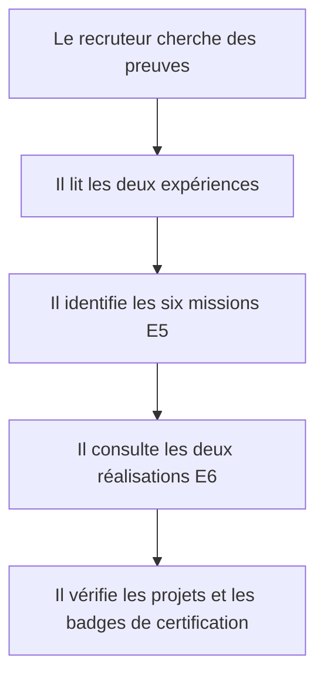
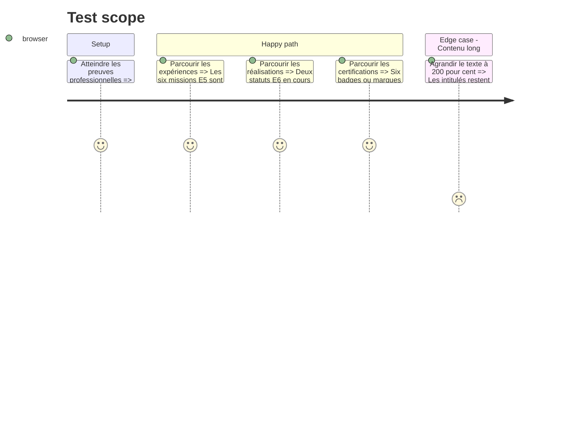

# Instruction: Expériences, réalisations et certifications

## Architecture projection

> Tree of the final files. ✅ create · ✏️ modify · ❌ delete

```txt
.
├── src/features/home/components
│   ├── home-certifications-preview.tsx                           ✏️ afficher les badges et alléger la grille
│   ├── home-e5-preview.tsx                                       ✏️ raconter les deux expériences et leurs six missions
│   ├── home-e6-preview.tsx                                       ✏️ distinguer clairement les deux réalisations en cours
│   └── home-projects-preview.tsx                                 ✏️ présenter le portfolio comme preuve de construction
├── src/features/home/home.data.ts                                ✏️ retirer les duplications de certifications si elles deviennent inutiles
└── src/features/home/home.types.ts                               ✏️ supprimer les types devenus redondants
```

## User Journey



## Test Scope



## Wireframe

```txt
┌──────────────────────────────────────────┐
│ (1) Deux expériences reliées             │
│     ├─ trois missions                    │
│     └─ trois missions                    │
├────────────────────┬─────────────────────┤
│ (2) Réalisation E6 │ (3) Réalisation E6 │
├────────────────────┴─────────────────────┤
│ (4) Projet personnel mis en contexte     │
├──────────────────────────────────────────┤
│ (5) Badges de certifications             │
└──────────────────────────────────────────┘
```

1. Expériences : deux contextes réels et six missions E5.
2–3. E6 : deux réalisations séparées avec leur état réel.
4. Projet : preuve de développement et de documentation.
5. Certifications : badges officiels lorsqu'ils existent et marques typographiques sinon.

## Tasks to do

### `1)` Transformer les missions en récit professionnel

> Montrer une progression et des responsabilités plutôt qu'une simple grille.

1. Relier les deux stages par une chronologie visuelle.
2. Conserver exactement les six missions et leurs organisations.
3. Fournir des liens explicites vers les fiches E5 et le parcours.

### `2)` Donner un poids juste aux travaux en cours

> Valoriser E6 sans suggérer des résultats non encore démontrés.

1. Afficher les deux réalisations avec le statut « En cours ».
2. Mettre en avant l'infrastructure PME comme réalisation principale.
3. Garder le projet portfolio comme preuve complémentaire séparée.

### `3)` Montrer les badges de certification

> Rendre les acquis identifiables sans publier les certificats.

1. Réutiliser les données canoniques de la feature certifications.
2. Afficher les trois images officielles et les trois marques Anthropic.
3. Maintenir le lien vers le catalogue complet.

## Test acceptance criteria

| Task | Acceptance criteria |
| ---- | ------------------- |
| 1 | Les deux organisations, les deux périodes et exactement six missions E5 sont présentes dans un ordre clair. |
| 2 | Les deux réalisations E6 affichent leur statut réel et chaque lien mène à la bonne route. |
| 3 | Six certifications sont identifiables, les trois images possèdent un texte alternatif utile et aucun certificat PDF n'est exposé. |
