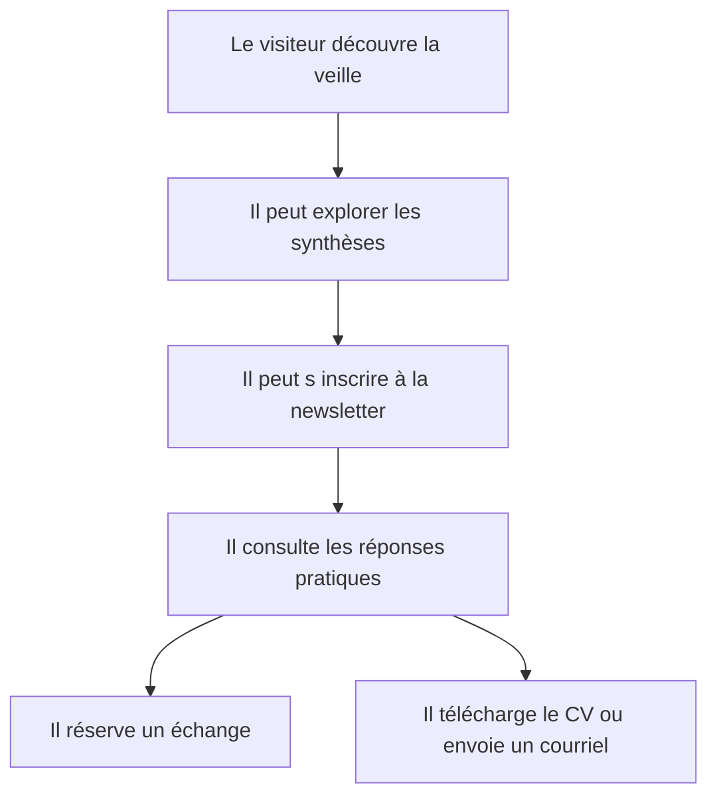
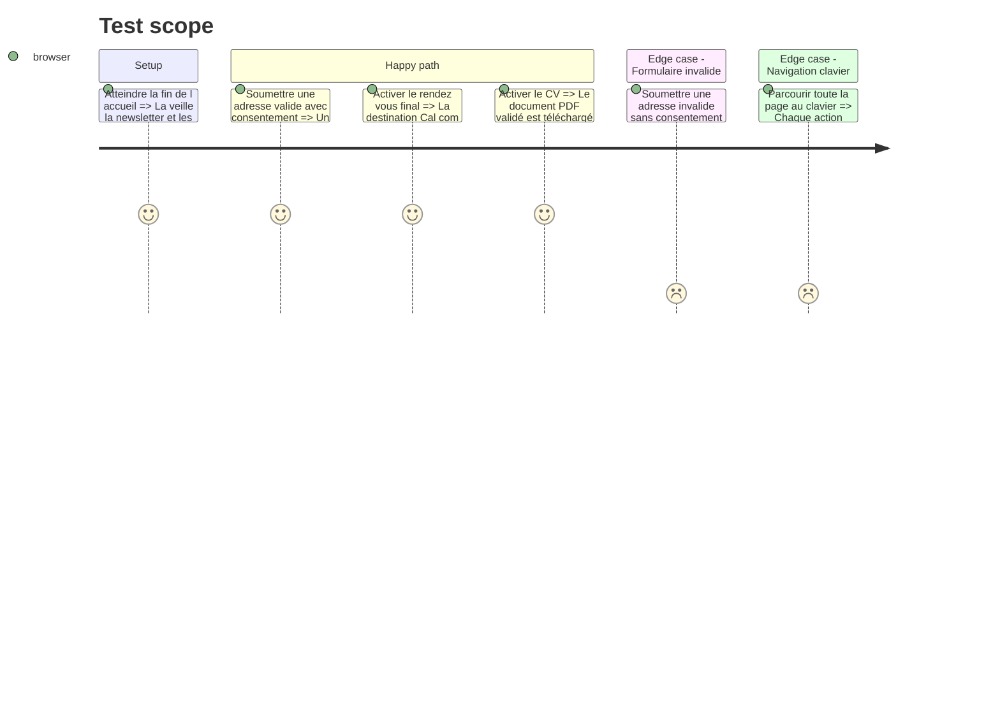

# Instruction: Veille, objections, conversion et validation

## Architecture projection

> Tree of the final files. ✅ create · ✏️ modify · ❌ delete

```txt
.
└── src/features/home/components
    ├── home-contact-cta.tsx                                     ✏️ conclure sur une prise de rendez-vous dominante
    ├── home-faq.tsx                                             ✅ répondre aux questions pratiques des recruteurs
    ├── home-page.test.tsx                                       ✏️ aligner les tests sur la nouvelle chronologie et les actions
    ├── home-page.tsx                                            ✏️ assembler la chronologie finale
    └── home-watch-preview.tsx                                   ✏️ réunir veille technologique et inscription newsletter
```

## User Journey



## Test Scope



## Wireframe

```txt
┌─────────────────────┬────────────────────┐
│ (1) Veille et lien  │ (2) Newsletter    │
├─────────────────────┴────────────────────┤
│ (3) Questions pratiques                  │
├──────────────────────────────────────────┤
│ (4) Rendez-vous principal                │
│     Courriel · CV                        │
└──────────────────────────────────────────┘
```

1. Veille : sujet, méthode et accès aux synthèses.
2. Newsletter : inscription réelle avec consentement et retours d'état.
3. Questions : disponibilité, mobilité, modes de travail, BTS et contact.
4. Conversion : rendez-vous dominant, courriel et CV secondaires.

## Tasks to do

### `1)` Réunir veille et newsletter

> Montrer une démarche active et permettre de suivre les prochaines publications.

1. Présenter le sujet de veille et sa méthode en peu de texte.
2. Intégrer le formulaire Resend existant sans dupliquer sa logique.
3. Conserver un lien clair vers l'espace de veille complet.

### `2)` Lever les objections avant le contact

> Répondre aux questions qui retardent une décision recruteur.

1. Ajouter six questions et réponses concises fondées sur les informations validées.
2. Utiliser des éléments natifs accessibles sans état client supplémentaire.
3. Éviter toute promesse ou information non confirmée.

### `3)` Finaliser la conversion et vérifier l'ensemble

> Terminer la page par une prochaine étape évidente et testée.

1. Donner la priorité visuelle au rendez-vous puis au courriel et au CV.
2. Mettre à jour les tests de structure, de contenu et de destinations.
3. Vérifier lint, tests, build, largeurs 320, 768 et 1440 pixels, clavier, contraste et mouvement réduit.

## Test acceptance criteria

| Task | Acceptance criteria |
| ---- | ------------------- |
| 1 | La veille et le formulaire newsletter sont visibles sur l'accueil, fonctionnent avec la Server Action existante et annoncent leurs états. |
| 2 | Six réponses pratiques sont consultables au clavier et ne contiennent aucune information non validée. |
| 3 | Le rendez-vous est l'action finale dominante, le courriel et le CV restent disponibles, et lint, tests, build ainsi que la QA navigateur réussissent. |
