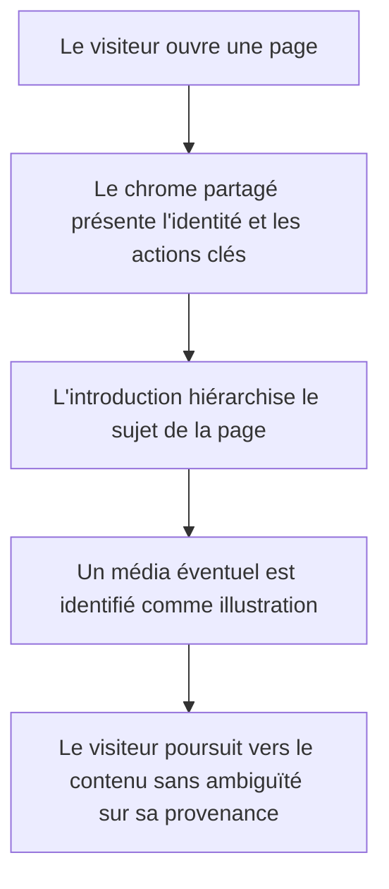
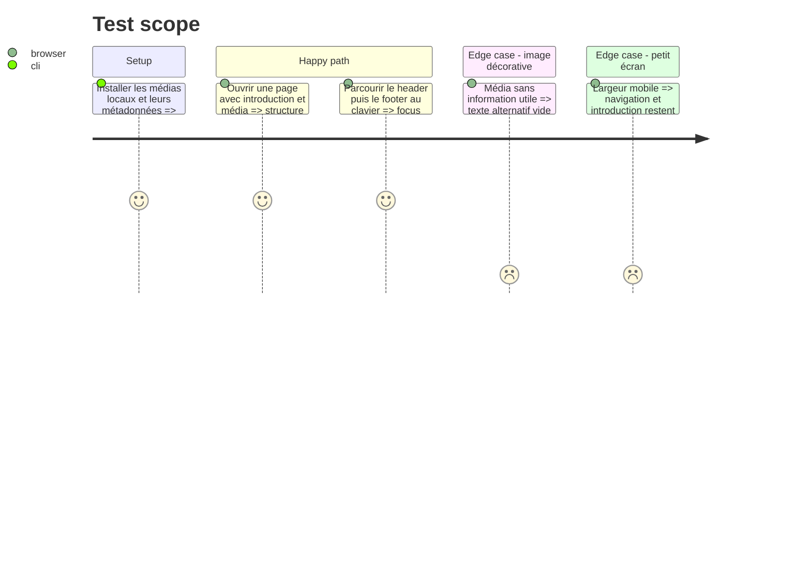

<!-- Fill or omit these sections; never add, rename, or reorder one. -->

# Instruction: Installer les fondations visuelles et la gouvernance des médias

## Architecture projection

> Tree of the final files. ✅ create · ✏️ modify · ❌ delete

```txt
.
├── aidd_docs
│   └── memory
│       └── external
│           └── editorial-images.md                         ✅
├── public
│   └── images
│       └── editorial
│           ├── ai-watch.webp                               ✅
│           ├── network-infrastructure.webp                  ✅
│           ├── support-workspace.webp                       ✅
│           └── web-development.webp                         ✅
└── src
    ├── app
    │   └── globals.css                                      ✏️
    └── shared
        ├── components
        │   ├── editorial-media.test.tsx                     ✅
        │   ├── editorial-media.tsx                          ✅
        │   ├── page-intro.test.tsx                          ✅
        │   ├── page-intro.tsx                               ✅
        │   ├── site-footer.tsx                              ✏️
        │   ├── site-header.test.tsx                         ✏️
        │   └── site-header.tsx                              ✏️
        └── config
            └── editorial-media.config.ts                    ✅
```

## User Journey



## Test Scope

<!-- Required for every phase. Keep Setup, Happy path, any qualifying Edge cases, and any required Teardown in this one journey. -->



## Wireframe

<!-- UI phase only. No UI => omit the section, don't invent one. -->

```txt
┌──────────────────────────────────────────────────────────┐
│ (1) Header: identité · navigation · CV · rendez-vous      │
├──────────────────────────────────────────────────────────┤
│ (2) Fil / libellé de page                                │
│ ┌──────────────────────────┬───────────────────────────┐ │
│ │ (3) Titre + introduction │ (4) Média éditorial       │ │
│ │     + action éventuelle  │     + légende/source      │ │
│ └──────────────────────────┴───────────────────────────┘ │
├──────────────────────────────────────────────────────────┤
│ (5) Contenu propre à la page                             │
├──────────────────────────────────────────────────────────┤
│ (6) Footer: navigation secondaire · contact · statut     │
└──────────────────────────────────────────────────────────┘

1. Header : conserve l'identité et rend CV, rendez-vous et navigation immédiatement accessibles.
2. Libellé : situe rapidement la rubrique consultée.
3. Introduction : porte la hiérarchie éditoriale commune aux pages internes.
4. Média : illustre le thème avec une provenance explicite lorsqu'il ne s'agit pas d'une preuve.
5. Contenu : reçoit les composants propres à chaque feature.
6. Footer : ferme le parcours avec les liens et coordonnées utiles.
```

## Tasks to do

### `1)` Définir le système visuel

> Transformer la palette actuelle en tokens cohérents et rendre les surfaces moins rigides.

1. Fixer en OKLCH les couleurs encre, charbon chaud, cuivre, ambre, ivoire et leurs niveaux atténués.
2. Porter les rayons principaux à 16–20 px, avec des rayons plus généreux réservés aux actions en pilule.
3. Ajouter les primitives de surface, halo, bordure chaude, ombre douce, rythme vertical et texture discrète.
4. Conserver les états de focus, la réduction des mouvements et des contrastes WCAG AA.

### `2)` Sélectionner et tracer les médias temporaires

> Fournir quatre photographies réelles haute définition, sûres et remplaçables.

1. Choisir sur Unsplash des images sans visage reconnaissable, logo ni marque dominante pour le support, le réseau, le développement et la veille IA.
2. Télécharger les originaux autorisés, recadrer et convertir en WebP adaptés au plus grand affichage prévu.
3. Enregistrer pour chaque fichier l'auteur, l'URL exacte, la licence, la date de récupération et les usages prévus.
4. Centraliser les dimensions, textes alternatifs, légendes et provenance dans une configuration typée.

### `3)` Créer les primitives éditoriales partagées

> Encapsuler le rendu accessible et responsive des introductions et illustrations.

1. Créer un composant de média avec `next/image`, ratio réservé, `sizes`, légende facultative et variante décorative.
2. Créer une introduction de page composable acceptant libellé, titre, résumé, actions et média éventuel.
3. Tester les textes alternatifs, les légendes, les titres et la composition sans média.

### `4)` Moderniser le chrome global

> Harmoniser l'en-tête et le pied de page avec la nouvelle identité sans réduire la conversion.

1. Adoucir les conteneurs, séparateurs et actions du header en conservant le bouton CV ajouté et le lien Cal.com.
2. Recomposer le footer avec coordonnées, navigation secondaire et disponibilité.
3. Vérifier la navigation clavier, les libellés accessibles et le comportement mobile.

## Test acceptance criteria

<!-- Each criterion is an observable behavior, not a command. -->

| Task | Acceptance criteria              |
| ---- | -------------------------------- |
| 1 | Les surfaces utilisent les nouveaux tokens, les cartes principales ont des rayons de 16–20 px et tous les textes/actions conservent un contraste WCAG AA. |
| 2 | Quatre images locales haute définition sont disponibles, chacune avec auteur, URL source, licence, date et rôle documentaire enregistrés ; aucune ne montre de personne ou marque reconnaissable. |
| 3 | Une introduction fonctionne avec ou sans média ; toute image informative possède un texte alternatif pertinent et toute illustration temporaire affiche une légende de provenance. |
| 4 | Le header affiche navigation, CV et rendez-vous sur desktop comme sur mobile, et l'ensemble header/footer est entièrement utilisable au clavier. |
