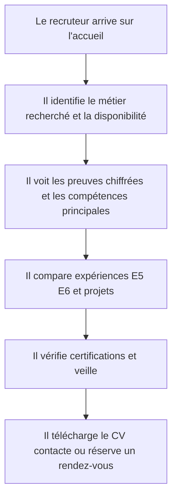
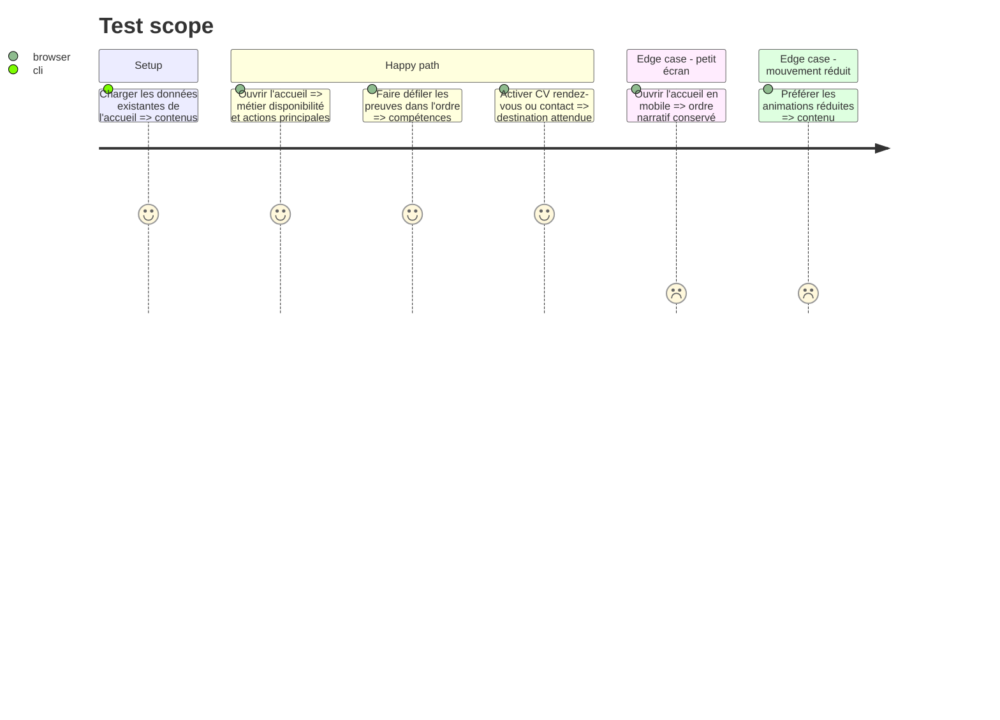

<!-- Fill or omit these sections; never add, rename, or reorder one. -->

# Instruction: Recomposer l'accueil éditorial et le parcours recruteur

## Architecture projection

> Tree of the final files. ✅ create · ✏️ modify · ❌ delete

```txt
.
└── src
    └── features
        └── home
            ├── components
            │   ├── home-certifications-preview.tsx         ✏️
            │   ├── home-contact-cta.tsx                    ✏️
            │   ├── home-e5-preview.tsx                     ✏️
            │   ├── home-e6-preview.tsx                     ✏️
            │   ├── home-hero.tsx                           ✏️
            │   ├── home-page.test.tsx                      ✏️
            │   ├── home-page.tsx                           ✏️
            │   ├── home-projects-preview.tsx               ✏️
            │   ├── home-proof-strip.tsx                    ✏️
            │   ├── home-skills-preview.tsx                 ✏️
            │   └── home-watch-preview.tsx                  ✏️
            ├── home.data.ts                                ✏️
            └── home.types.ts                               ✏️
```

## User Journey



## Test Scope

<!-- Required for every phase. Keep Setup, Happy path, any qualifying Edge cases, and any required Teardown in this one journey. -->



## Wireframe

<!-- UI phase only. No UI => omit the section, don't invent one. -->

```txt
┌──────────────────────────────────────────────────────────┐
│ (1) Header: identité · navigation · CV · rendez-vous      │
├─────────────────────────────┬────────────────────────────┤
│ (2) Métier · disponibilité  │ (3) Photo personnelle     │
│     proposition · actions   │     actuelle              │
├──────────────────────────────────────────────────────────┤
│ (4) Bandeau de preuves chiffrées                         │
├──────────────────────────────────┬───────────────────────┤
│ (5) Compétences principales      │ média support        │
├──────────────────────┬───────────────────────────────────┤
│ (6) Parcours terrain │ missions E5 regroupées           │
├──────────────────────────────────┬───────────────────────┤
│ (7) Réalisations E6 en cours     │ média infrastructure │
├──────────────────────┬───────────────────────────────────┤
│ (8) Projet sélectionné + preuve │ autres projets        │
├─────────────────────────────┬────────────────────────────┤
│ (9) Certifications/badges   │ (10) Veille éditoriale   │
├──────────────────────────────────────────────────────────┤
│ (11) CTA final: CV · contact · rendez-vous                │
├──────────────────────────────────────────────────────────┤
│ (12) Footer                                              │
└──────────────────────────────────────────────────────────┘

1. Header : maintient les actions de conversion accessibles dès l'arrivée.
2. Hero : permet de décider rapidement si le profil correspond au besoin.
3. Photo : conserve l'unique image personnelle comme ancrage authentique.
4. Preuves : résume expériences, missions, E6 et certifications.
5. Compétences : met en avant support, systèmes, réseaux, virtualisation et développement.
6. Parcours/E5 : relie les terrains de stage aux six missions réelles.
7. E6 : présente deux réalisations sans masquer leur statut en cours.
8. Projets : privilégie une preuve visuelle réelle lorsqu'elle existe.
9. Certifications : montre les badges authentiques sans décoration générique.
10. Veille : donne un aperçu du futur traitement magazine.
11. CTA : conclut par les trois modes de contact prioritaires.
12. Footer : fournit les repères secondaires.
```

## Tasks to do

### `1)` Recomposer le hero et les preuves immédiates

> Rendre la décision recruteur possible dès le premier écran.

1. Conserver la photo personnelle en visuel dominant avec un cadrage responsive et un traitement plus nuancé.
2. Hiérarchiser poste recherché, disponibilité, zone géographique et modes de travail.
3. Maintenir CV, Cal.com, contact et accès aux réalisations au-dessus de la ligne de flottaison lorsque l'espace le permet.
4. Transformer le bandeau chiffré en preuve compacte et moins quadrillée.

### `2)` Installer le rythme éditorial de l'accueil

> Remplacer l'enchaînement de grilles carrées par une narration asymétrique mais prévisible.

1. Alterner blocs texte, listes hiérarchisées, cartes de tailles variables et médias illustratifs.
2. Employer les photographies temporaires uniquement pour contextualiser support, infrastructure et veille.
3. Garder toutes les rubriques essentielles et leur ordre de priorité validé.
4. Éviter les répétitions de boutons tout en donnant une sortie claire à chaque section.

### `3)` Mettre en valeur les preuves authentiques

> Distinguer explicitement faits, statuts, badges et illustrations.

1. Conserver les organisations, missions E5, statuts E6, badges et informations de projet existants.
2. Afficher les badges de certification comme éléments authentiques, sans les mélanger aux photos libres de droits.
3. Ajouter les légendes d'illustration aux médias temporaires visibles sur l'accueil.

### `4)` Tester le parcours de conversion

> Verrouiller les informations essentielles et leurs destinations.

1. Étendre les tests de rendu aux titres de sections, preuves clés et actions CV/Cal.com/contact.
2. Vérifier l'ordre mobile et l'absence de perte d'information entre desktop et mobile.
3. Vérifier que le mode mouvement réduit supprime les animations non essentielles.

## Test acceptance criteria

<!-- Each criterion is an observable behavior, not a command. -->

| Task | Acceptance criteria              |
| ---- | -------------------------------- |
| 1 | À l'ouverture, le visiteur identifie le métier, la disponibilité, l'Île-de-France et au moins une action CV/contact/rendez-vous ; la photo affichée est bien la photo personnelle existante. |
| 2 | Toutes les rubriques validées apparaissent dans l'ordre recruteur et la page ne présente plus une succession uniforme de rectangles bord à bord. |
| 3 | Les six missions E5, les deux E6 en cours et les six certifications restent fidèles aux données ; toute photo de stock est marquée comme illustration. |
| 4 | Les parcours CV, Cal.com et contact atteignent leurs destinations, sans débordement horizontal à 375 px et sans animation persistante avec `prefers-reduced-motion`. |
