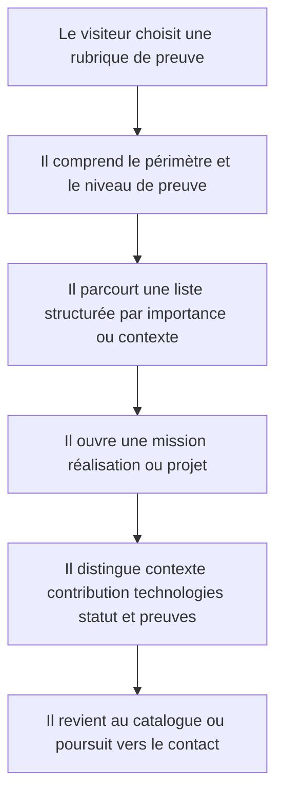
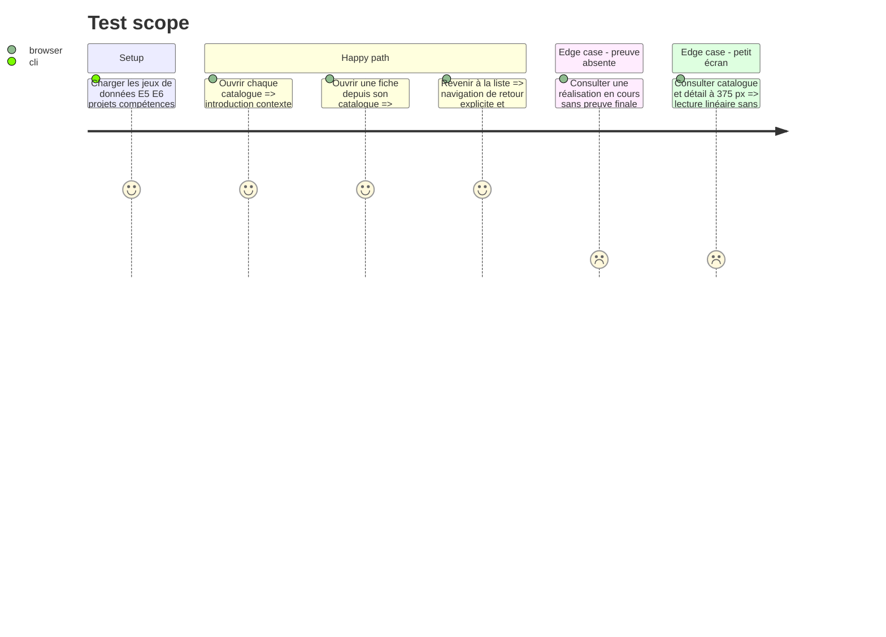

<!-- Fill or omit these sections; never add, rename, or reorder one. -->

# Instruction: Repenser les pages de preuves, le parcours et les réalisations

## Architecture projection

> Tree of the final files. ✅ create · ✏️ modify · ❌ delete

```txt
.
├── public
│   └── images
│       └── projects
│           └── portfolio-overview.webp                     ✅
└── src
    ├── app
    │   ├── competences
    │   │   └── page.tsx                                   ✏️
    │   ├── epreuves
    │   │   ├── e5
    │   │   │   └── page.tsx                               ✏️
    │   │   └── e6
    │   │       └── page.tsx                               ✏️
    │   ├── parcours
    │   │   └── page.tsx                                   ✏️
    │   └── projets
    │       └── page.tsx                                   ✏️
    └── features
        ├── bts-e5
        │   └── components
        │       ├── e5-detail.tsx                           ✏️
        │       └── e5-list.tsx                             ✏️
        ├── bts-e6
        │   └── components
        │       ├── e6-detail.tsx                           ✏️
        │       └── e6-list.tsx                             ✏️
        ├── experiences
        │   └── components
        │       └── experience-timeline.tsx                 ✏️
        ├── projects
        │   ├── components
        │   │   ├── project-detail.tsx                      ✏️
        │   │   └── project-list.tsx                        ✏️
        │   ├── project.types.ts                            ✏️
        │   └── projects.data.ts                            ✏️
        └── skills
            └── components
                └── skills-catalog.tsx                      ✏️
```

## User Journey



## Test Scope

<!-- Required for every phase. Keep Setup, Happy path, any qualifying Edge cases, and any required Teardown in this one journey. -->



## Wireframe

<!-- UI phase only. No UI => omit the section, don't invent one. -->

```txt
CATALOGUE
┌──────────────────────────────────────────────────────────┐
│ (1) Header partagé                                       │
├──────────────────────────────┬───────────────────────────┤
│ (2) Introduction de rubrique │ (3) Illustration légendée│
├──────────────────────────────────────────────────────────┤
│ (4) Filtres visuels / groupes / repères de niveau        │
├────────────────────┬─────────────────────────────────────┤
│ (5) Élément majeur │ (6) Éléments secondaires           │
│     + statut       │     de formats variés              │
├────────────────────┴─────────────────────────────────────┤
│ (7) Sortie: rubrique suivante · contact                  │
└──────────────────────────────────────────────────────────┘

DÉTAIL
┌──────────────────────────────────────────────────────────┐
│ (1) Header partagé · retour au catalogue                 │
├───────────────────────────────────┬──────────────────────┤
│ (2) Titre · contexte · statut     │ (3) Repères clés    │
├───────────────────────────────────┴──────────────────────┤
│ (4) Besoin / démarche / contribution                     │
├──────────────────────────────┬───────────────────────────┤
│ (5) Technologies et acquis  │ (6) Preuves authentiques │
├──────────────────────────────┴───────────────────────────┤
│ (7) Navigation précédente/suivante ou retour             │
└──────────────────────────────────────────────────────────┘

1. Header/retour : garde le contexte et facilite la navigation.
2. Introduction : explique la rubrique ou la réalisation avant les détails.
3. Média/repères : illustre sans simuler une preuve et résume les faits essentiels.
4. Groupes/contribution : organise le contenu selon son contexte métier.
5. Élément majeur/technologies : donne la priorité aux compétences les plus probantes.
6. Éléments/preuves : distingue les preuves consultables des informations déclaratives.
7. Sortie : évite les impasses et conduit vers la suite du parcours.
```

## Tasks to do

### `1)` Unifier les introductions de catalogues

> Donner à compétences, parcours, E5, E6 et projets un cadre éditorial commun.

1. Remplacer les en-têtes dupliqués par la primitive d'introduction partagée.
2. Affecter seulement les médias pertinents à chaque rubrique et afficher leur légende illustrative.
3. Conserver les métadonnées SEO et les titres existants.

### `2)` Recomposer compétences et expériences

> Faire ressortir le support systèmes/réseaux et les deux terrains de stage.

1. Organiser les compétences par priorité métier, niveau et preuves associées plutôt que par cartes égales.
2. Transformer la chronologie en récit à deux terrains, avec périodes, poste, missions et outils clairement séparés.
3. Préserver les marques autorisées et ne pas utiliser de photographie de stock comme représentation des organisations.

### `3)` Moderniser E5 et E6 sans réécrire les faits

> Clarifier le lien entre mission, contexte, compétences et niveau d'avancement.

1. Regrouper visuellement les six missions E5 par organisation et conserver leurs liens de détail.
2. Mettre les statuts des deux réalisations E6 au premier niveau de lecture.
3. Recomposer les détails avec contexte, besoin, contribution, technologies, résultats et preuves.
4. Laisser explicite toute preuve manquante ou réalisation en cours.

### `4)` Donner aux projets une preuve visuelle réelle

> Mettre la démonstration du travail avant la décoration.

1. Produire une capture haute définition du portfolio réel, exempte de données sensibles, puis l'optimiser en WebP.
2. Étendre les données de projet pour référencer une preuve visuelle authentique et son texte alternatif.
3. Recomposer liste et détail autour du problème, de la contribution, de la méthode, des technologies et des preuves.

## Test acceptance criteria

<!-- Each criterion is an observable behavior, not a command. -->

| Task | Acceptance criteria              |
| ---- | -------------------------------- |
| 1 | Les cinq catalogues partagent une hiérarchie d'introduction cohérente, conservent leurs métadonnées et identifient toute image libre de droits comme illustration. |
| 2 | Les compétences support, Windows Server/Linux, réseaux, virtualisation et développement sont prioritaires ; EDLearn et Secours Catholique restent présentés comme deux stages au même poste avec leurs périodes respectives. |
| 3 | Les six missions E5 sont regroupées sous la bonne organisation et les deux E6 restent marquées en cours tant que leurs preuves ne sont pas finalisées. |
| 4 | Le projet portfolio affiche une capture réelle lisible avec texte alternatif, et aucune capture ne contient de donnée personnelle ou professionnelle sensible. |
