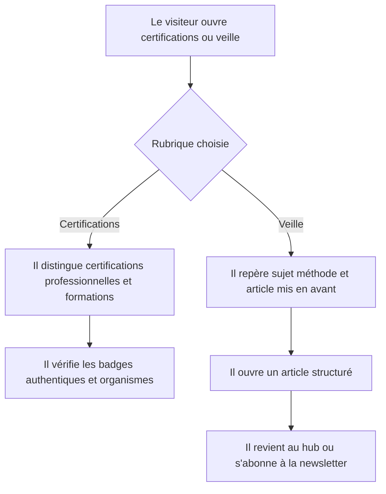
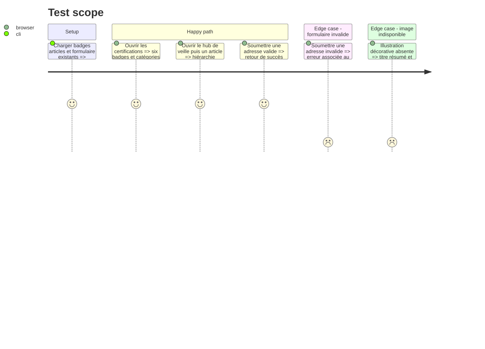

<!-- Fill or omit these sections; never add, rename, or reorder one. -->

# Instruction: Valoriser les certifications et transformer la veille en magazine

## Architecture projection

> Tree of the final files. ✅ create · ✏️ modify · ❌ delete

```txt
.
└── src
    ├── app
    │   └── certifications
    │       └── page.tsx                                   ✏️
    └── features
        ├── certifications
        │   └── components
        │       ├── certification-card.tsx                  ✏️
        │       └── certification-catalog.tsx               ✏️
        ├── newsletter
        │   └── components
        │       ├── newsletter-form.test.tsx                ✏️
        │       └── newsletter-form.tsx                     ✏️
        └── tech-watch
            └── components
                ├── watch-article.tsx                       ✏️
                └── watch-hub.tsx                           ✏️
```

## User Journey



## Test Scope

<!-- Required for every phase. Keep Setup, Happy path, any qualifying Edge cases, and any required Teardown in this one journey. -->



## Wireframe

<!-- UI phase only. No UI => omit the section, don't invent one. -->

```txt
CERTIFICATIONS
┌──────────────────────────────────────────────────────────┐
│ (1) Header + introduction                                │
├──────────────────────────────────────────────────────────┤
│ (2) Catégorie principale                                 │
│ ┌─────────────────────────┐ ┌───────────┐ ┌───────────┐  │
│ │ badge + organisme       │ │ badge     │ │ badge     │  │
│ └─────────────────────────┘ └───────────┘ └───────────┘  │
├──────────────────────────────────────────────────────────┤
│ (3) Formations complémentaires + badges authentiques     │
└──────────────────────────────────────────────────────────┘

VEILLE
┌──────────────────────────────────────────────────────────┐
│ (1) En-tête magazine: sujet · méthode · rythme            │
├───────────────────────────────────┬──────────────────────┤
│ (2) Article principal + média     │ (3) Articles récents│
├──────────────────────┬────────────┴──────────────────────┤
│ (4) Axes de veille   │ (5) Grille éditoriale            │
├──────────────────────┴───────────────────────────────────┤
│ (6) Newsletter: promesse · email · consentement          │
└──────────────────────────────────────────────────────────┘

ARTICLE
┌──────────────────────────────────────────────────────────┐
│ (1) Retour · thème · date · temps de lecture              │
├───────────────────────────────────┬──────────────────────┤
│ (2) Titre + résumé                │ (3) Média légendé   │
├───────────────────────────────────┴──────────────────────┤
│ (4) Corps de l'article                                   │
├──────────────────────────────────────────────────────────┤
│ (5) Sources · article suivant · newsletter               │
└──────────────────────────────────────────────────────────┘

1. En-tête : annonce clairement la nature de la rubrique.
2. Élément principal : donne la priorité au badge ou à l'article le plus structurant.
3. Éléments récents : rendent le reste du catalogue rapidement comparable.
4. Axes : explicite IA, développement web et développement applicatif.
5. Grille : organise les articles sans uniformité excessive.
6. Newsletter : conclut la consultation avec une inscription compréhensible.
```

## Tasks to do

### `1)` Recomposer le catalogue de certifications

> Mettre les six badges réels au centre du dispositif.

1. Utiliser l'introduction partagée sans photographie décorative générique.
2. Distinguer certifications professionnelles, certificats de cours et formations complémentaires.
3. Donner plus de présence aux badges authentiques tout en conservant organisme, intitulé et statut.

### `2)` Créer la une de veille

> Donner au hub une lecture de magazine technologique.

1. Installer une hiérarchie une, articles récents, axes suivis et méthode de veille.
2. Associer l'illustration IA uniquement à la dimension éditoriale et afficher sa provenance.
3. Conserver les sujets actuels et les routes statiques existantes.

### `3)` Améliorer la lecture des articles

> Donner une structure confortable et crédible aux contenus longs.

1. Limiter la largeur de lecture et renforcer titre, chapô, métadonnées, sections et sources.
2. Prévoir une zone média légendée sans exiger une image pour chaque article.
3. Ajouter des sorties explicites vers le hub, un article voisin et la newsletter.

### `4)` Intégrer la newsletter au nouveau système

> Conserver la collecte existante tout en alignant sa présentation et son accessibilité.

1. Adapter champs, bouton et messages aux nouveaux tokens et rayons.
2. Conserver les états chargement, succès et erreur ainsi que leur annonce accessible.
3. Mettre à jour les tests du formulaire pour les libellés et états réellement affichés.

## Test acceptance criteria

<!-- Each criterion is an observable behavior, not a command. -->

| Task | Acceptance criteria              |
| ---- | -------------------------------- |
| 1 | Les six certifications/formations attendues apparaissent avec leurs vrais badges et sont réparties dans des catégories compréhensibles sans photo générique. |
| 2 | Le hub présente un article principal, les articles récents, les axes IA/web/applicatif et la méthode de veille dans une hiérarchie distincte d'une grille de cartes uniforme. |
| 3 | Chaque article reste lisible sans image, affiche ses métadonnées et sources, et propose un retour au hub ainsi qu'une suite de parcours. |
| 4 | Le formulaire annonce correctement validation, chargement, succès et erreur au clavier comme au lecteur d'écran, sans modifier le contrat serveur existant. |
