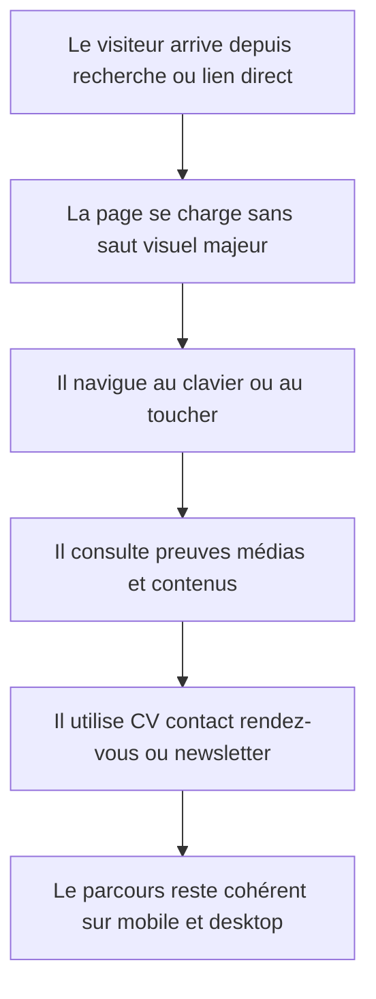
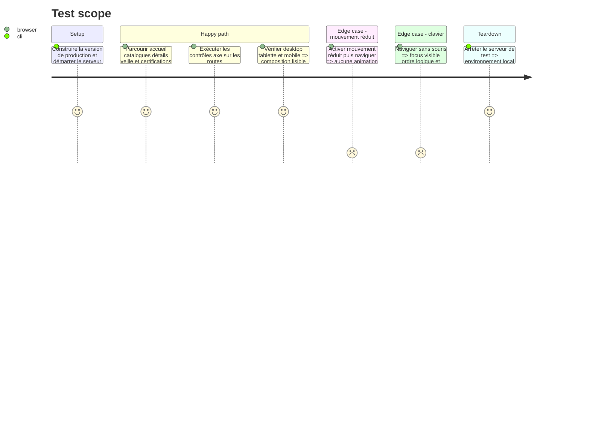

<!-- Fill or omit these sections; never add, rename, or reorder one. -->

# Instruction: Valider la refonte sur tout le portfolio et actualiser sa mémoire

## Architecture projection

> Tree of the final files. ✅ create · ✏️ modify · ❌ delete

```txt
.
├── aidd_docs
│   └── memory
│       ├── codebase-map.md                                 ✏️
│       ├── design.md                                       ✏️
│       └── testing.md                                      ✏️
└── tests
    └── e2e
        ├── bts-evidence.spec.ts                            ✏️
        ├── newsletter-accessibility.spec.ts                ✏️
        ├── recruiter-journey.spec.ts                       ✏️
        └── visual-system.spec.ts                           ✅
```

## User Journey



## Test Scope

<!-- Required for every phase. Keep Setup, Happy path, any qualifying Edge cases, and any required Teardown in this one journey. -->



## Tasks to do

### `1)` Étendre la couverture de parcours

> Prouver que la refonte conserve les contenus et conversions existants.

1. Mettre à jour les tests E5/E6 pour les nouveaux repères visuels sans les coupler aux classes CSS.
2. Étendre le parcours recruteur aux pages compétences, parcours, projets, certifications et veille.
3. Vérifier CV, Cal.com, contact, navigation retour et newsletter.

### `2)` Verrouiller accessibilité et responsive

> Contrôler les risques introduits par les compositions asymétriques et les médias.

1. Ajouter une couverture axe sur les modèles accueil, catalogue, détail et article.
2. Tester 375 px, tablette et desktop pour débordements, ordre de lecture, recadrages et actions.
3. Tester navigation clavier, focus visible, textes alternatifs et mouvement réduit.

### `3)` Contrôler performance et stabilité visuelle

> Maintenir une expérience rapide malgré l'ajout d'images haute définition.

1. Vérifier que seule l'image LCP utile est préchargée et que les autres médias restent différés.
2. Vérifier dimensions intrinsèques, `sizes`, poids optimisé et absence de hotlinking.
3. Comparer l'affichage des routes principales en build de production et corriger les sauts de mise en page observables.

### `4)` Synchroniser la mémoire projet

> Faire de la nouvelle identité une règle durable pour Claude, Codex et Antigravity.

1. Documenter palette, rayons, typographie, usages photo, attribution et distinction illustration/preuve.
2. Actualiser la carte des composants partagés et des emplacements de médias.
3. Actualiser la stratégie de tests avec Playwright, axe et les routes représentatives.

## Test acceptance criteria

<!-- Each criterion is an observable behavior, not a command. -->

| Task | Acceptance criteria              |
| ---- | -------------------------------- |
| 1 | Le parcours automatisé traverse toutes les rubriques principales et confirme les destinations CV, Cal.com, contact, détails et newsletter sans dépendre des classes de présentation. |
| 2 | Les modèles de page ne présentent aucune violation axe sérieuse/critique, aucun débordement à 375 px et restent entièrement navigables au clavier avec mouvement réduit. |
| 3 | Toutes les images éditoriales sont servies localement avec dimensions ou ratio réservé et `sizes` adapté ; seul le média LCP est prioritaire et aucun saut visuel majeur n'est observé. |
| 4 | La mémoire projet décrit fidèlement le système de design, la gouvernance des médias, les composants partagés et la couverture de tests effectivement livrés. |
