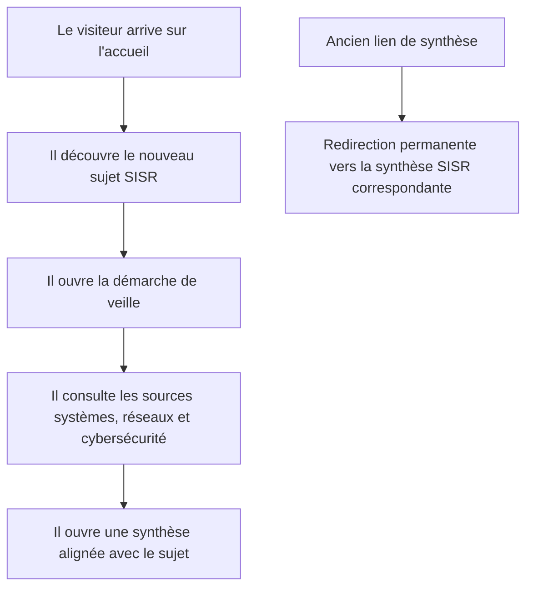
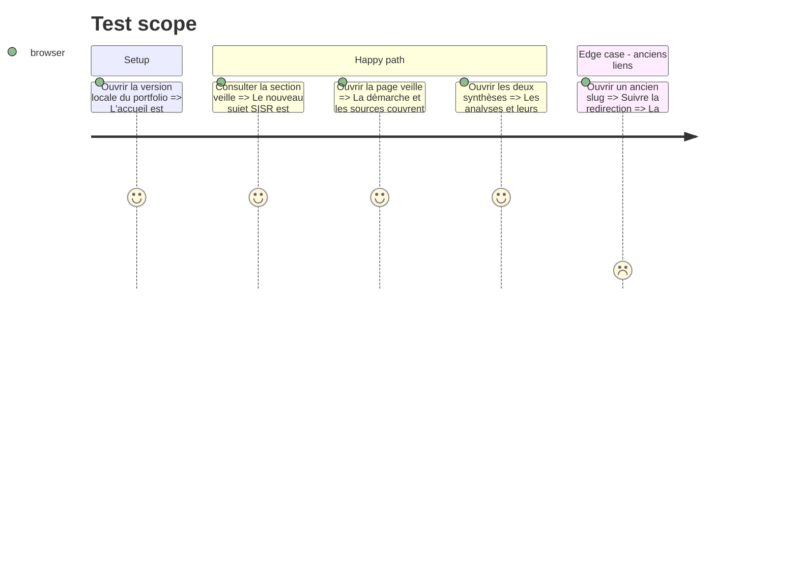

# Instruction: Réécriture éditoriale SISR et vérification du parcours

## Architecture projection

> Tree of the final files. ✅ create · ✏️ modify · ❌ delete

```txt
.
├── next.config.ts                                                   ✏️ rediriger les anciens slugs de veille
├── tests
│   └── e2e
│       └── recruiter-journey.spec.ts                               ✏️ vérifier les nouveaux slugs dans le sitemap et les redirections
└── src
    ├── app
    │   └── veille
    │       ├── page.tsx                                             ✏️ aligner la description de la page
    │       └── articles
    │           └── page.tsx                                         ✏️ aligner la description du registre
    ├── emails
    │   ├── email-template.registry.tsx                              ✏️ aligner le texte brut de confirmation
    │   └── templates
    │       ├── newsletter-confirmation.email.tsx                    ✏️ aligner le contenu HTML de confirmation
    │       └── watch-digest.email.tsx                               ✏️ aligner le sous-titre et l'exemple de synthèse
    └── features
        ├── home
        │   └── components
        │       └── home-page.test.tsx                               ✏️ vérifier le nouveau titre sur l'accueil
        ├── projects
        │   └── project-collection.data.ts                           ✏️ renommer le projet de veille associé
        └── tech-watch
            ├── components
            │   └── watch-hub.tsx                                    ✏️ réécrire la présentation et la méthode SISR
            ├── tech-watch.data.test.ts                              ✏️ verrouiller le sujet et les axes SISR
            ├── tech-watch.data.ts                                   ✏️ remplacer sujet, sources et synthèses
            └── tech-watch.types.ts                                  ✏️ adapter les catégories de sources
```

## User Journey



## Test Scope



## Tasks to do

### `1)` Centraliser le nouveau sujet SISR

> Faire du sujet validé la référence éditoriale visible sur l'accueil et le hub.

1. Remplacer le titre, la problématique, les critères et les catégories de sources.
2. Réécrire la justification, les objectifs et la méthode autour des pratiques SISR.
3. Aligner les métadonnées et la carte de projet liée à la veille.

### `2)` Publier deux synthèses cohérentes avec le sujet

> Remplacer les contenus orientés développement par des analyses systèmes, réseaux et cybersécurité.

1. Créer une synthèse sur le diagnostic réseau assisté dans Cisco Catalyst Center.
2. Créer une synthèse sur l'administration Intune assistée par Security Copilot.
3. Utiliser uniquement des sources officielles vérifiées et expliciter les limites et la validation humaine.
4. Rediriger les anciennes URL vers les nouveaux slugs.

### `3)` Aligner la newsletter et verrouiller le changement

> Éviter que les confirmations ou futurs digests réintroduisent l'ancien sujet.

1. Modifier les versions HTML et texte des modèles de veille sans les publier chez Resend.
2. Mettre à jour les exemples de prévisualisation.
3. Adapter les tests éditoriaux et E2E aux nouvelles URL canoniques.
4. Vérifier que les anciens slugs redirigent vers les nouvelles synthèses.
5. Exécuter les contrôles du projet et la QA navigateur.

## Test acceptance criteria

| Task | Acceptance criteria |
| ---- | ------------------- |
| 1 | L'accueil, `/veille`, `/veille/articles` et leurs métadonnées présentent l'IA appliquée à l'administration des systèmes, des réseaux et à la cybersécurité, sans ancien intitulé orienté développement applicatif. |
| 2 | Deux synthèses accessibles couvrent respectivement le diagnostic réseau Cisco et l'administration Intune, citent des sources officielles et rappellent les limites ainsi que la validation humaine. |
| 2 | Les deux anciens slugs retournent une redirection permanente vers les nouveaux articles. |
| 3 | Les modèles de confirmation et de digest décrivent le nouveau sujet, et aucun modèle distant Resend n'est synchronisé ou publié pendant cette phase. |
| 3 | Le sitemap contient les deux nouveaux slugs, les anciennes URL redirigent de façon permanente et les tests E2E vérifient ces comportements. |
| 3 | Le lint, TypeScript, les tests, le build et les contrôles navigateur applicables réussissent sans régression. |
